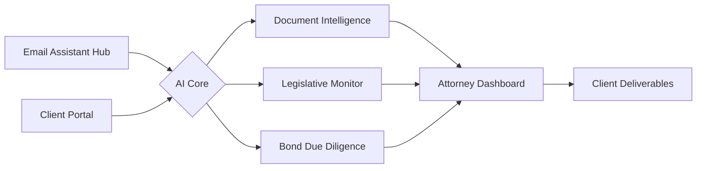
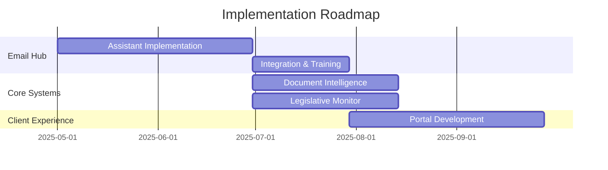

# AI-Powered Legal Intelligence Platform

<div align="center">

[](https://www.squizai.com)
[](./development_plan.md)

**Revolutionizing how White Bear Ankele Tanaka & Waldron manages special districts and bond due diligence**

</div>

## The White Bear Ankele Challenge

As Colorado's premier law firm specializing in special districts and local governments, White Bear Ankele Tanaka & Waldron faces unique challenges managing their extensive portfolio:

| | | |
|:---:|:---:|:---:|
| ⏱️ | 🔍 | 📈 |
| **Time-Intensive Processes** | **Oversight Risk** | **Scaling Challenges** |
| Attorneys spend 40% of time on routine document preparation | Complex legislative changes create compliance risks | Growing district portfolio requires scalable resources |

**175+ Special Districts** · **300+ Bond Issuances** · **3,000+ Monthly Emails**

## Our Comprehensive Solution

Our integrated AI platform combines five powerful components:

| Component | Function |
|:---:|---|
| 📧 **EMAIL ASSISTANT** | Primary entry point for all client communications |
| 📝 **DOCUMENT INTELLIGENCE** | Automated generation of legal documents |
| 📊 **LEGISLATIVE MONITORING** | Proactive analysis of regulatory changes |
| 💼 **BOND DUE DILIGENCE** | Risk assessment and compliance tracking |
| 🔐 **CLIENT PORTAL** | Secure collaboration platform |

## 📧 Email Assistant Hub: The Primary Entry Point

Our intelligent email processing system serves as the primary entry point for the entire AI platform, revolutionizing how White Bear Ankele manages client communications:

- **Natural Language Understanding** - Automatically identifies client needs, extracts key information, and routes appropriately
- **Automated Response Generation** - Creates personalized replies to common inquiries with attorney review
- **Document Attachment Processing** - Analyzes, categorizes, and stores attached documents with intelligent tagging
- **Meeting Scheduling** - Coordinates attorney availability and client preferences for efficient scheduling
- **Cross-System Integration** - Triggers appropriate workflows in document generation, legislative monitoring, and client portal systems

> "The Email Assistant Hub will reduce response time by 85% while increasing attorney capacity by 40%"

[Explore Email Assistant Hub →](./optimization_plans/06_email_assistant_hub.md)

## Solution Architecture



### Key Benefits

- **70% Efficiency Gains** in legislative review
- **90% Reduction** in document errors  
- **40% Capacity Increase** without staffing changes
- **85% Faster** client response times

### Technology

- **Advanced NLP** for document understanding
- **Custom ML Models** for legal classification
- **Secure Architecture** with legal ethics firewalls
- **Email-First Strategy** for immediate ROI

## Implementation Timeline



[View Full Implementation Plan →](./implementation_guides/implementation_roadmap.md)

## Project Documentation

```
colorado_legal_investors/
├── README.md                     # Project overview
├── optimization_plans/           # Strategic transformation plans
│   ├── 00_optimization_master_plan.md
│   ├── 01_digital_presence_plan.md
│   ├── ...
│   └── 06_email_assistant_hub.md
├── process_maps/                 # Visual workflow diagrams
│   ├── due_diligence_workflow.md
│   └── email_assistant_workflow.md
├── implementation_guides/        # Implementation roadmaps
│   ├── implementation_roadmap.md
│   └── project_entry_point.md
└── development_plan.md           # Overall development strategy
```

## Next Steps

<div align="center">

| <h3>📋</h3> | <h3>🔍</h3> | <h3>🚀</h3> |
|:---:|:---:|:---:|
| **Discovery Workshop** | **Email Assistant Demo** | **Implementation Plan** |
| Map current processes | See the primary entry point | Receive your tailored roadmap |
| [Schedule Now](mailto:matty@prjctcode.ai?subject=WBA%20Discovery%20Workshop) | [Request Demo](mailto:matty@prjctcode.ai?subject=WBA%20Email%20Assistant%20Demo) | [Get Started](mailto:matty@prjctcode.ai?subject=WBA%20Implementation%20Plan) |

> **Pro Tip:** Begin with the Email Assistant Hub for fastest ROI and minimal disruption

</div>

---

<div align="center">

**SquizAI** | Transforming Legal Technology | © 2025

📧 matty@prjctcode.ai · 📱 (817)368-9117 · 🌐 www.squizai.com

</div>
