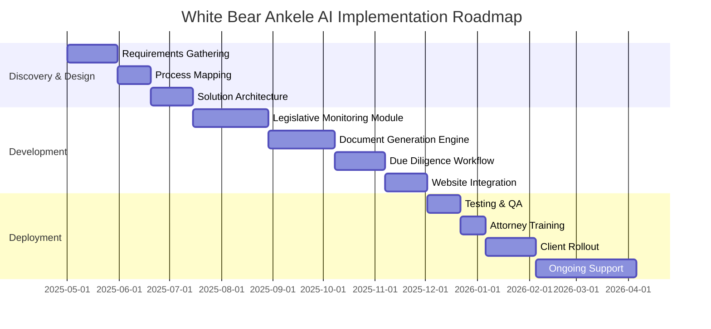

# AI-Powered Due Diligence Solution for White Bear Ankele

## Transforming Special District Bond Management with AI

A custom AI solution designed specifically for White Bear Ankele Tanaka & Waldron to revolutionize investment bond due diligence, document drafting, and legislative analysis for Colorado special districts.

## How Our AI Development Firm Can Help White Bear Ankele

As Colorado's largest law firm specializing in special districts and local governments, White Bear Ankele faces unique challenges in managing complex legislative analysis for investment bonds. Our AI solution addresses these specific needs:

### Problem Statement

White Bear Ankele currently manages hundreds of special districts, each requiring meticulous legislative monitoring, bond due diligence, and document preparation. This process is:
- Time-intensive for specialized attorneys
- Subject to potential human oversight in complex legislative changes
- Challenging to scale as the firm's district portfolio grows
- Difficult to standardize while maintaining district-specific customizations

### Our AI Solution

We propose building a tailored AI platform that will:

1. **Automated Legislative Monitoring**
   - Continuous scanning of Colorado bills (https://leg.colorado.gov/bills)
   - AI-powered relevance filtering for special district bond implications
   - Proactive alerts on legislative changes affecting specific client districts

2. **Intelligent Document Generation**
   - AI-assisted drafting of bond disclosure documents
   - Automated service plan generation with district-specific customization
   - Smart templates for intergovernmental agreements

3. **Due Diligence Acceleration**
   - Predictive analysis of bond compliance requirements
   - Automated cross-reference of new legislation against existing district obligations
   - Risk scoring for bond structures based on legislative history

4. **Web-Based Platform Integration**
   - Seamless integration with White Bear Ankele's existing website
   - Secure client portal for document collaboration and review
   - Interactive dashboard for tracking legislative impacts on specific districts

5. **Client-Facing Benefits**
   - Real-time status updates on bond due diligence progress
   - Interactive document markup and approval workflows
   - Simplified district board meeting management tools

## Competitive Advantages for White Bear Ankele

- **Efficiency Gains**: Reduce time spent on routine legislative review by up to 70%
- **Error Reduction**: AI verification reduces human oversight in complex regulatory compliance
- **Scalability**: Manage more special districts without proportional staffing increases
- **Client Satisfaction**: Provide faster, more transparent service with consistent quality
- **Knowledge Retention**: Capture the expertise of senior attorneys in AI models that persist

## Implementation Approach



## Technology Stack

- **Core AI**: Advanced natural language processing for legislative analysis
- **Document Processing**: Specialized legal document understanding models
- **Web Platform**: Secure, HIPAA-compliant client portal with role-based access
- **Integration**: API-driven connection to White Bear Ankele's existing systems
- **Security**: End-to-end encryption with specialized legal ethics firewalls

## Project Structure

```
colorado_legal_investors/
├── src/
│   ├── legislative_monitor/  # AI-powered bill monitoring
│   ├── document_generator/   # Intelligent legal document creation
│   ├── due_diligence/        # Bond analysis and compliance tools
│   └── web_platform/         # Website integration and client portal
├── docs/
│   ├── process_maps/         # Legal workflow diagrams
│   └── templates/            # AI-ready document templates
└── tests/                    # Comprehensive testing suite
```

## Next Steps

To begin transforming how White Bear Ankele handles bond due diligence:

1. **Discovery Workshop**: Schedule a focused session with key attorneys to map current processes
2. **Prototype Demo**: Present initial AI capabilities tailored to special district needs
3. **Pilot Program**: Implement solution for a subset of districts to demonstrate ROI

## Contact

To discuss how our AI development firm can revolutionize White Bear Ankele's bond due diligence processes, please contact:

**AI Development Team**  
Email: team@example.com  
Phone: (555) 123-4567

## License

Proprietary and Confidential
