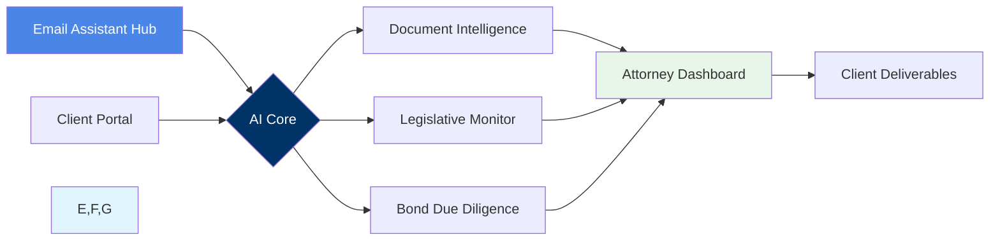
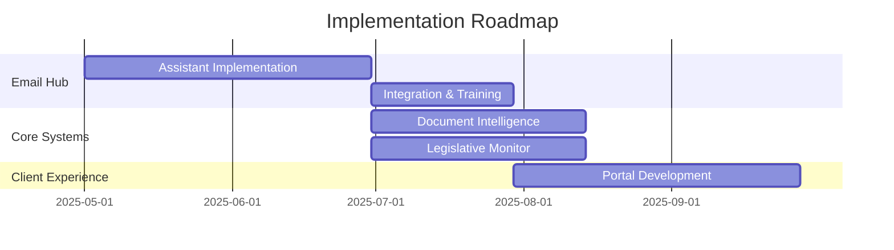

# AI-Powered Legal Intelligence Platform

<p align="center">
  
  
</p>

> Revolutionizing how White Bear Ankele Tanaka & Waldron manages special districts and bond due diligence

## The White Bear Ankele Challenge

As Colorado's premier law firm specializing in special districts and local governments, White Bear Ankele Tanaka & Waldron faces unique challenges managing their extensive portfolio:

- ⏱️ **Time-Intensive Processes**: Attorneys spend 40% of their time on routine document preparation and legislative review
- 🔍 **Oversight Risk**: Complex legislative changes create potential for critical compliance oversights
- 📈 **Scaling Challenges**: Growing district portfolio requires resources to scale proportionally
- 📝 **Standardization Hurdles**: Balancing document standardization with district-specific customization

## Our Comprehensive Solution

Our integrated AI platform combines five powerful components:

| Component | Function |
|:---:|---|
| 📧 **EMAIL ASSISTANT** | Primary entry point for all client communications |
| 📝 **DOCUMENT INTELLIGENCE** | Automated generation of legal documents |
| 📊 **LEGISLATIVE MONITORING** | Proactive analysis of regulatory changes |
| 💼 **BOND DUE DILIGENCE** | Risk assessment and compliance tracking |
| 🔐 **CLIENT PORTAL** | Secure collaboration platform |

## 📧 Email Assistant Hub: The Primary Entry Point

Our intelligent email processing system serves as the primary entry point for the entire AI platform, revolutionizing how White Bear Ankele manages client communications:

- **Natural Language Understanding** - Automatically identifies client needs, extracts key information, and routes appropriately
- **Automated Response Generation** - Creates personalized replies to common inquiries with attorney review
- **Document Attachment Processing** - Analyzes, categorizes, and stores attached documents with intelligent tagging
- **Meeting Scheduling** - Coordinates attorney availability and client preferences for efficient scheduling
- **Cross-System Integration** - Triggers appropriate workflows in document generation, legislative monitoring, and client portal systems

> "The Email Assistant Hub will reduce response time by 85% while increasing attorney capacity by 40%"

[Explore Email Assistant Hub →](./docs/optimization_plans/06_email_assistant_hub.md)

## Solution Architecture



### Key Benefits

- **70% Efficiency Gains** in legislative review
- **90% Reduction** in document errors  
- **40% Capacity Increase** without staffing changes
- **85% Faster** client response times

### Technology

- **Advanced NLP** for document understanding
- **Custom ML Models** for legal classification
- **Secure Architecture** with legal ethics firewalls
- **Email-First Strategy** for immediate ROI

## Implementation Timeline



[View Full Implementation Plan →](./docs/implementation_guides/implementation_roadmap.md)

## Project Documentation

```
docs/
├── optimization_plans/       # Strategic transformation plans
│   ├── 00_master_plan.md
│   ├── 01_digital_presence_plan.md
│   ├── ...
│   └── 06_email_assistant_hub.md
├── process_maps/             # Visual workflow diagrams
│   └── email_assistant_workflow.md
└── implementation_guides/    # Implementation roadmaps
```

## Next Steps

1. **Discovery Workshop** - Map current processes and identify opportunities
2. **Email Assistant Demo** - See the primary entry point in action
3. **Implementation Plan** - Receive a tailored roadmap for your firm

> **Pro Tip:** Begin with the Email Assistant Hub for fastest ROI

## Contact

| Contact | Details |
|---|---|
| **Email** | matty@prjctcode.ai |
| **Phone** | (817)368-9117 |

---

**SquizAI** | Transforming Legal Technology | © 2025
