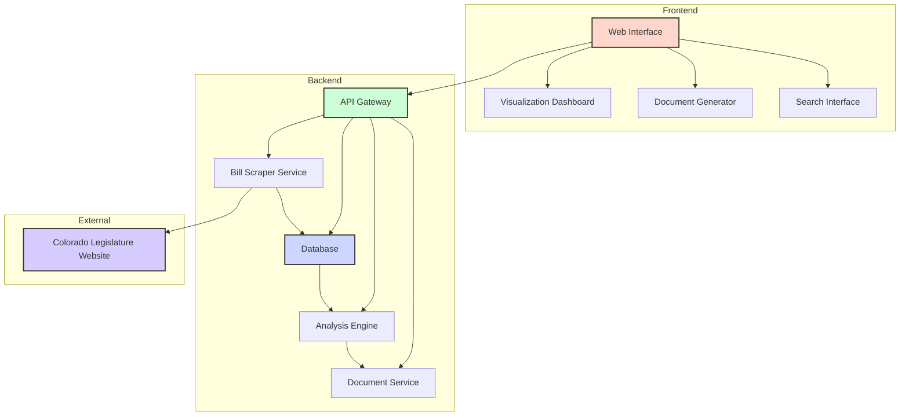
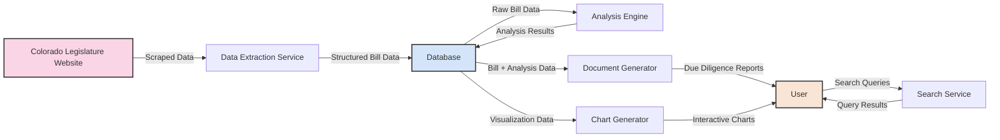
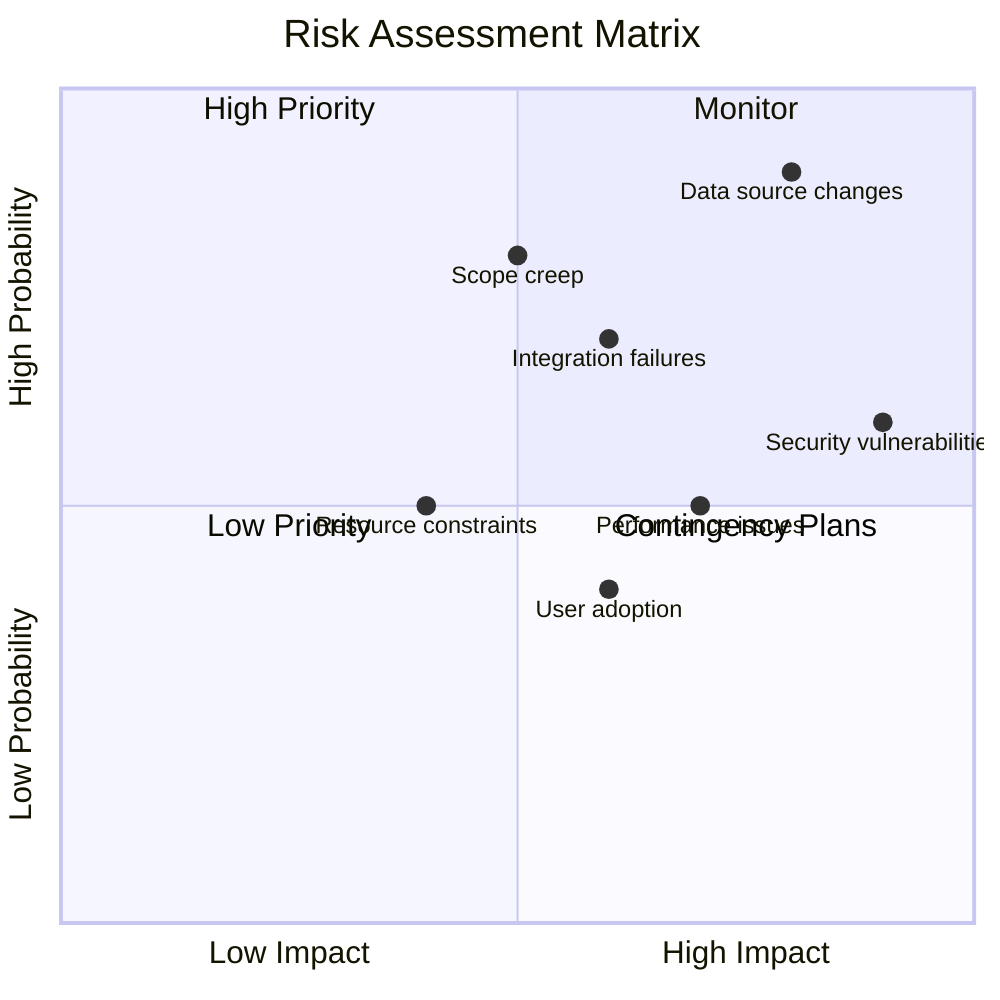
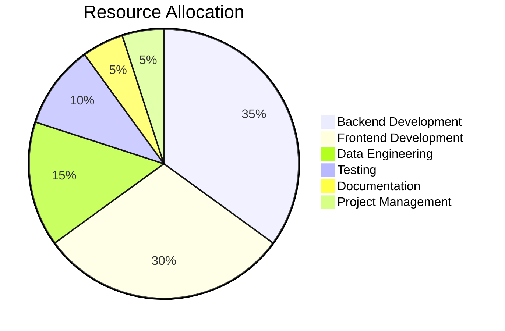

# Development Plan: Colorado Legal Investors Due Diligence Tool

## Project Overview
A comprehensive web application for legal professionals to conduct due diligence on investment bonds by analyzing Colorado legislative bills. The tool will scrape, analyze, and generate discovery documents with visualizations to streamline the due diligence process.

## Architecture Diagram

## Data Flow Diagram

## Development Phases

### Phase 1: Foundation (Weeks 1-2)
- Set up project structure and environment
- Implement data scraper for Colorado legislative bills
- Design database schema
- Develop basic API endpoints

### Phase 2: Core Functionality (Weeks 3-4)
- Implement bill analysis engine
- Develop document generation service
- Create basic UI for search and navigation
- Implement authentication and user management

### Phase 3: Advanced Features (Weeks 5-6)
- Develop visualization components and dashboards
- Implement advanced search and filtering
- Create templates for different due diligence documents
- Add collaboration features

### Phase 4: Integration & Testing (Weeks 7-8)
- Integrate all components
- Perform unit and integration testing
- User acceptance testing
- Performance optimization

### Phase 5: Deployment & Documentation (Weeks 9-10)
- Deploy to production environment
- Create comprehensive documentation
- User training materials
- Establish monitoring and maintenance plan

## Technical Stack

- **Frontend**: React.js, Chart.js, Mermaid.js
- **Backend**: Python (Flask), SQLAlchemy
- **Database**: PostgreSQL
- **Infrastructure**: Docker, GitHub Actions for CI/CD
- **Documentation**: Sphinx, Markdown

## Deliverables

1. Web application for due diligence management
2. Bill scraper and analyzer
3. Document generation engine
4. Interactive visualization dashboard
5. User documentation and training materials

## Risk Assessment

## Resource Allocation

