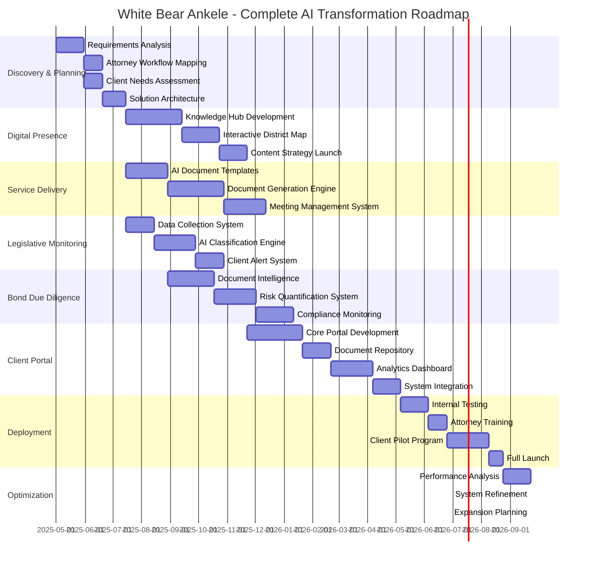
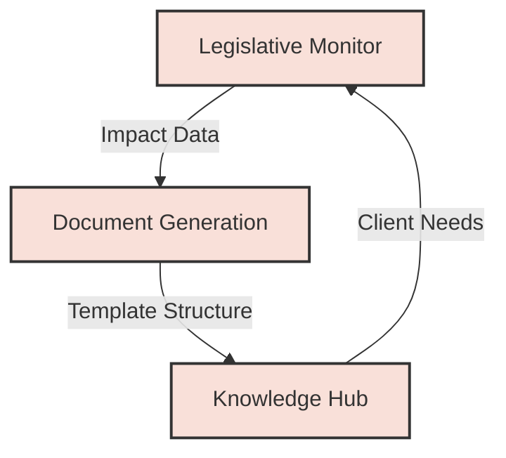
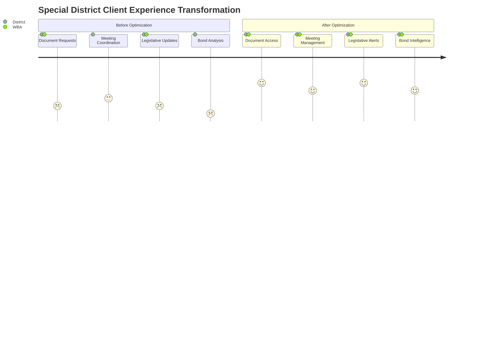
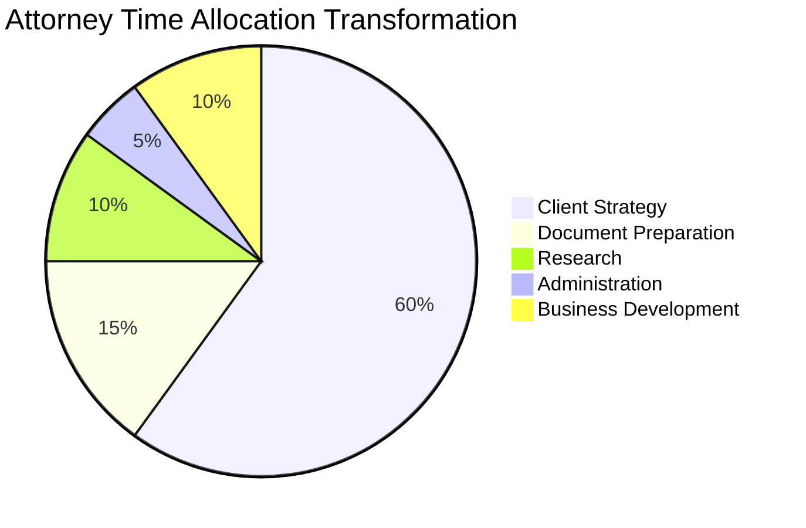
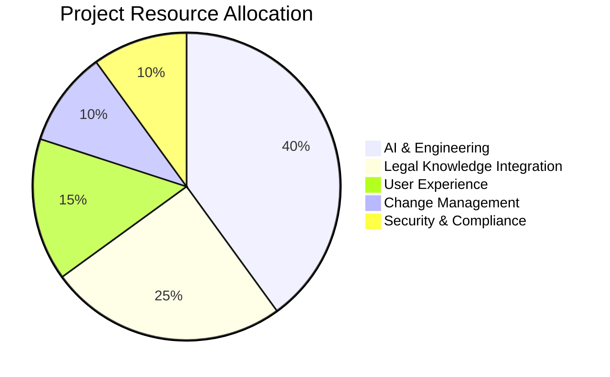
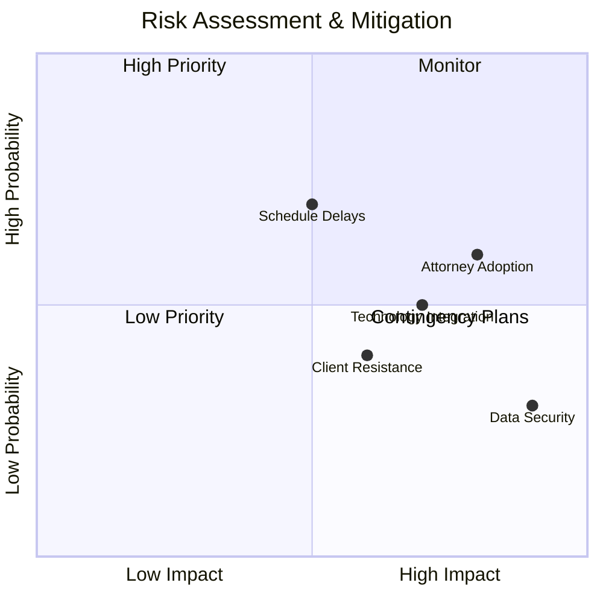

# White Bear Ankele AI Transformation: Implementation Roadmap

## Executive Overview

This document provides a comprehensive implementation roadmap for White Bear Ankele Tanaka & Waldron's AI-powered optimization initiatives. By following this structured approach, we will transform WBA's special district and bond management practice through strategic technology integration while maintaining their high-touch legal expertise.

## Holistic Implementation Timeline

## Phase 1: Foundation (Months 1-3)

| Milestone | Key Deliverables | Success Criteria | Dependencies |
|-----------|------------------|------------------|--------------|
| **Requirements Analysis** | Detailed workflow documentation, Process maps | Attorney sign-off on accuracy | Access to current systems |
| **System Architecture** | Technical design docs, Integration plans | Architecture review approval | Workflow documentation |
| **Data Strategy** | Data model, Security protocols | Legal compliance verification | Practice area requirements |

### Focus Area: Knowledge Collection
During this phase, our primary focus is capturing White Bear Ankele's specialized expertise in:
- Special district formation nuances
- Bond compliance requirements
- Legislative impact assessment methodologies
- Document template standardization opportunities

## Phase 2: Core Systems (Months 4-8)

| Milestone | Key Deliverables | Success Criteria | Dependencies |
|-----------|------------------|------------------|--------------|
| **Legislative Monitor** | Automated bill scraper, Classification engine | >95% relevance accuracy | Requirements analysis |
| **Document Generation** | Template library, AI assembly engine | Attorney review approval | Document standardization |
| **Knowledge Hub** | Interactive district map, Resource library | Client engagement metrics | Digital strategy approval |

### Integration Points
This phase establishes the foundational connections between:

## Phase 3: Advanced Capabilities (Months 8-14)

| Milestone | Key Deliverables | Success Criteria | Dependencies |
|-----------|------------------|------------------|--------------|
| **Bond Due Diligence** | Risk quantification, Automated analysis | Accuracy validation | Legislative monitor |
| **Client Portal** | Secure document repository, Meeting tools | User adoption rate | Document generation |
| **Analytics Dashboard** | District metrics, Performance tracking | Client feedback | Data integration |

### Client Experience Enhancement
This phase delivers significant client-facing improvements:

## Phase 4: Integration & Scaling (Months 14-18)

| Milestone | Key Deliverables | Success Criteria | Dependencies |
|-----------|------------------|------------------|--------------|
| **System Integration** | Unified platform, Single sign-on | Cross-system functionality | All core systems |
| **Attorney Workflow** | AI-assisted process, Time optimization | Efficiency metrics | System adoption |
| **Client Onboarding** | Training materials, Support resources | Client proficiency | Portal completion |

### Efficiency Transformation

## Phase 5: Optimization & Expansion (Months 18+)

| Milestone | Key Deliverables | Success Criteria | Dependencies |
|-----------|------------------|------------------|--------------|
| **Performance Analysis** | Metrics dashboard, ROI assessment | Target achievement | Full implementation |
| **System Refinement** | Optimization updates, Feature enhancements | User satisfaction | Usage analytics |
| **Expansion Planning** | Growth opportunities, Market analysis | Strategic alignment | Performance validation |

### Future Directions
- Geographic expansion beyond Colorado
- Practice area extensions
- Advanced AI capabilities
- Integration with public sector systems

## Critical Success Factors

1. **Attorney Engagement**
   - Early involvement in design decisions
   - Continuous feedback collection
   - Visible efficiency benefits

2. **Change Management**
   - Phased implementation approach
   - Comprehensive training program
   - Success story highlighting

3. **Technical Excellence**
   - Rigorous security standards
   - Performance optimization
   - Reliability and availability

4. **Client Adoption**
   - Intuitive user experience
   - Clear value demonstration
   - Dedicated support resources

## Resource Allocation

## Governance Structure

| Role | Responsibilities | Key Stakeholders |
|------|------------------|------------------|
| **Executive Sponsor** | Strategic direction, Resource approval | Managing Partner |
| **Project Board** | Decision making, Priority setting | Practice leaders, CTO |
| **Implementation Team** | Day-to-day execution, Issue resolution | Project manager, Technical leads |
| **Attorney Advisory** | Domain expertise, Validation testing | Selected attorneys from each practice |

## Risk Management

| Risk | Mitigation Strategy | Owner |
|------|---------------------|-------|
| **Attorney Adoption** | Early champions, Demonstrated value, Phased rollout | Change Manager |
| **Technology Integration** | Robust testing, Fallback mechanisms, Technical debt management | Technical Lead |
| **Schedule Delays** | Buffer time allocation, Critical path management, Clear dependencies | Project Manager |

## Measuring Success

The transformation will be measured against these key performance indicators:

| Metric Category | Specific Metrics | Target | Timeframe |
|-----------------|-----------------|--------|-----------|
| **Efficiency** | Attorney time savings, Document production time | 65%+ reduction | 12 months |
| **Quality** | Error reduction, Compliance rate | 90%+ accuracy | 6 months |
| **Client Experience** | Net Promoter Score, Portal adoption | 70+ NPS, 80%+ adoption | 18 months |
| **Growth** | District-to-attorney ratio, Revenue per district | 40%+ increase | 24 months |

## Next Steps

1. Executive presentation and approval
2. Formation of implementation team
3. Detailed sprint planning for Phase 1
4. Attorney engagement workshops
5. Initial data collection and analysis

---

*This implementation roadmap represents a living document that will evolve as the project progresses. Regular reviews and adjustments will ensure alignment with White Bear Ankele's strategic objectives and changing market conditions.*
