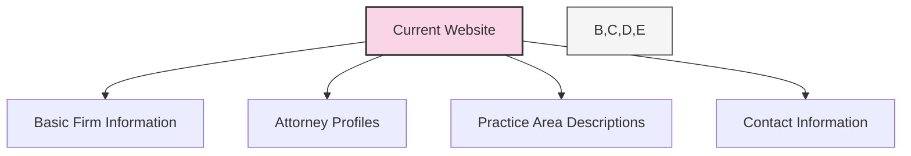
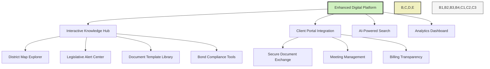
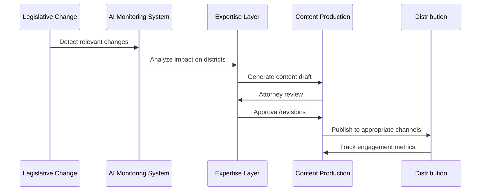

# Digital Presence & Knowledge Hub Optimization

## Current State Analysis

White Bear Ankele Tanaka & Waldron currently maintains a basic professional website that provides fundamental information about their practice areas and team. However, it lacks interactive elements that could showcase their specialized expertise in special districts and provide value-added resources to clients.

## Target State Vision

Our AI-powered knowledge hub will transform White Bear Ankele's digital presence into an interactive resource center that demonstrates thought leadership and provides practical tools for special district stakeholders.

## Implementation Plan

### Phase 1: Interactive Special District Resource Center (Months 1-3)

| Component | Description | Technology | Value Proposition |
|-----------|-------------|------------|-------------------|
| **Interactive District Map** | Geographic visualization of all Colorado special districts with filtering | React, MapBox, GeoJSON | Clients can explore district boundaries and relationships |
| **District Database** | Searchable repository of district regulations by county | PostgreSQL, Elasticsearch | Quick access to region-specific requirements |
| **Tax Impact Calculator** | Tool for estimating district tax implications | React, JavaScript | Developers can model various scenarios |

#### Technical Approach

1. **Data Collection & Processing**
   - Scrape public district information from county records
   - Process and standardize geographical boundaries
   - Create unified database of district regulations

2. **Front-End Development**
   - Develop interactive map with multiple layers
   - Create intuitive search interface with filters
   - Build responsive calculators with scenario modeling

3. **Integration Strategy**
   - Embed seamlessly in White Bear Ankele's website
   - Implement tracking for usage analytics
   - Create gated premium features for lead generation

### Phase 2: Content Marketing Enhancement (Months 3-6)

| Content Type | Topics | Frequency | Distribution |
|--------------|--------|-----------|--------------|
| **Webinars** | New legislation impact, Bond compliance | Monthly | Website, LinkedIn, Email |
| **Decision Trees** | District formation, Infrastructure financing | Quarterly | Interactive web tools |
| **Legislative Alerts** | Bill tracking with WBA analysis | As needed | Email, Portal notifications |

#### Content Management Workflow

### Phase 3: Integration & Analytics (Months 6-9)

| Component | Metrics | Application |
|-----------|---------|-------------|
| **User Journey Tracking** | Engagement, content preference | Content optimization |
| **Lead Scoring** | Interaction frequency, resource usage | Business development targeting |
| **Client Portal Integration** | Resource utilization, information needs | Service improvement |

## Resource Requirements

- **Development**: Front-end developer, Data engineer, GIS specialist
- **Content**: Legal writer, Graphic designer
- **Legal SMEs**: 3-5 hours/week from WBA attorneys
- **Technology**: Cloud hosting, MapBox licensing, CMS

## Success Metrics

- **Traffic**: 200% increase in website visitors within 6 months
- **Engagement**: 15+ minute average session duration
- **Lead Generation**: 30 qualified leads per month from interactive tools
- **Thought Leadership**: Recognition in 3+ industry publications

## Ongoing Maintenance

- Weekly content updates
- Monthly data refreshes for district information
- Quarterly feature enhancements based on usage analytics
