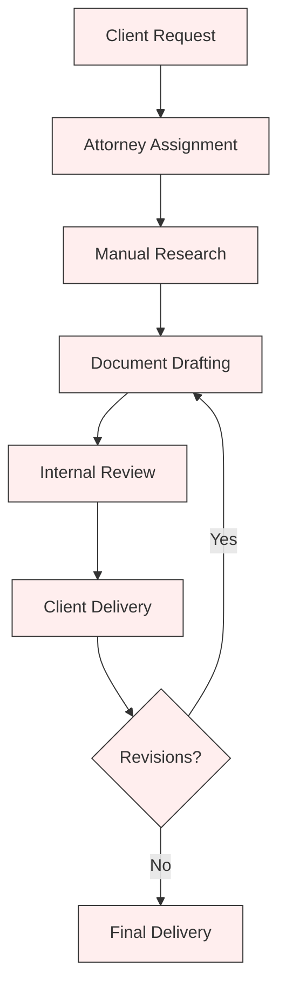
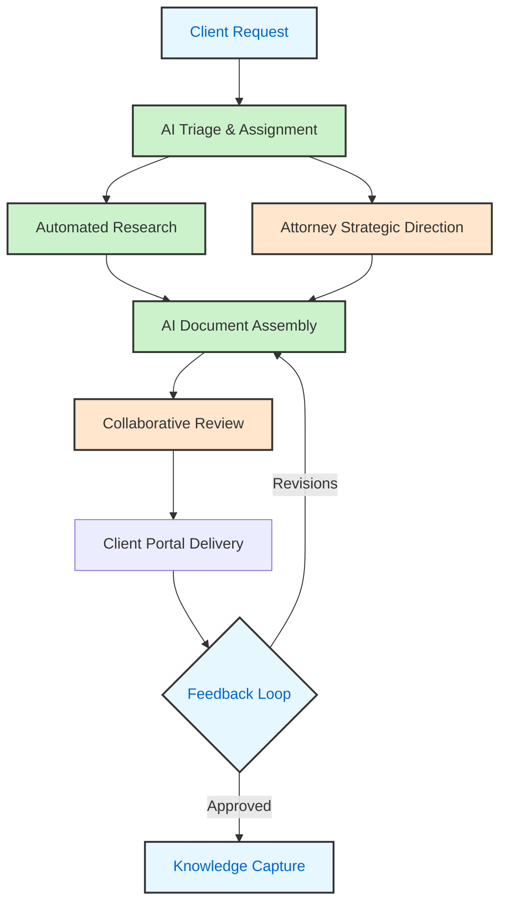
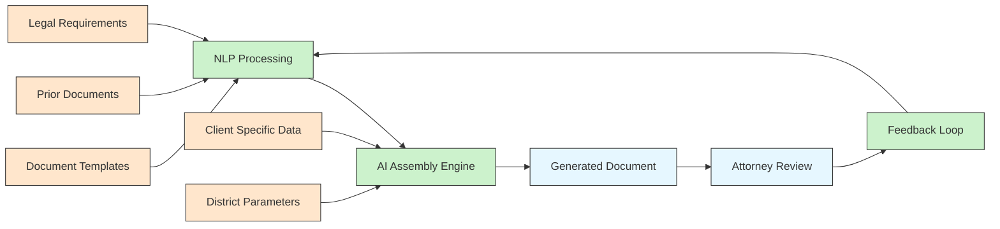
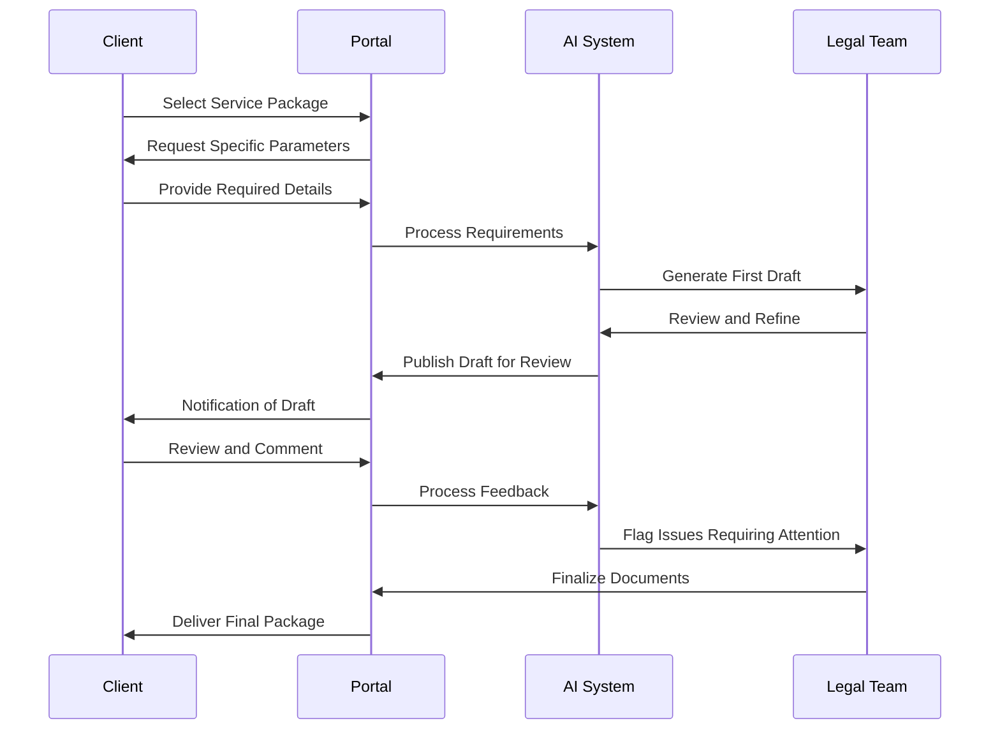
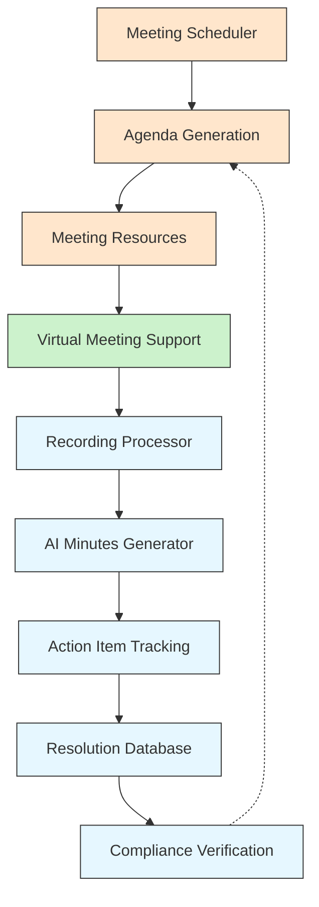
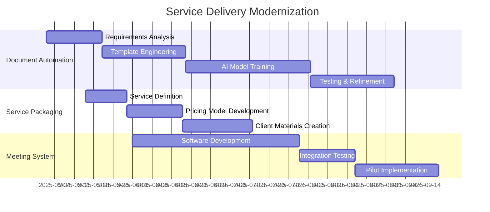

# Service Delivery Modernization for White Bear Ankele

## Current State Assessment

White Bear Ankele currently operates with a traditional legal service delivery model that relies heavily on attorney expertise and manual document preparation. While effective, this approach limits scalability and creates bottlenecks during high-demand periods.

## Modernization Vision

Our AI-powered service delivery model will transform how White Bear Ankele creates, delivers, and manages legal documents and services for their special district clients.

## Implementation Components

### 1. AI Document Generation Engine

| Document Type | Automation Potential | Complexity | Priority |
|---------------|---------------------|------------|----------|
| Service Plans | 80% | High | 🔴 High |
| Board Resolutions | 90% | Low | 🔴 High |
| Disclosure Documents | 75% | Medium | 🟠 Medium |
| Intergovernmental Agreements | 65% | High | 🟡 Low |

#### Technical Implementation

### 2. Service Packaging & Pricing

| Service Package | Components | Delivery Method | Pricing Model |
|-----------------|------------|-----------------|---------------|
| **Essential Formation** | Service Plan, Formation Documents, Initial Resolutions | Templated, AI-generated | Fixed Fee |
| **Compliance Guardian** | Annual Filings, Meeting Support, Disclosure Documents | Subscription, AI-monitored | Monthly Subscription |
| **Bond Assurance** | Due Diligence, Disclosure, Compliance Documentation | Hybrid, AI-assisted | Value-based Pricing |

#### Client Experience Flow

### 3. Meeting Management System

| Feature | Description | Client Value |
|---------|-------------|--------------|
| Agenda Builder | AI-assisted agenda creation based on district needs | Consistency, Compliance |
| Minutes Generator | Automated minutes based on meeting recordings | Time savings, Accuracy |
| Resolution Tracker | Track and manage all district resolutions | Organizational control |
| Action Item Monitor | Track assigned tasks and deadlines | Accountability |

#### System Architecture

## Implementation Timeline

## Technology Stack

- **Document Generation**: GPT-4 or equivalent LLM, custom legal fine-tuning
- **Client Interface**: React-based web application with responsive design
- **Meeting System**: WebRTC, automatic speech recognition, custom minute formatting
- **Backend**: Containerized microservices with secure API gateway
- **Storage**: HIPAA-compliant encrypted document storage

## Success Metrics

- **Efficiency**: 75% reduction in document creation time
- **Consistency**: 95% standardization across similar documents
- **Client Satisfaction**: 60+ NPS for new service delivery
- **Revenue**: 25% increase in per-district revenue
- **Capacity**: 40% increase in district-to-attorney ratio

## Change Management

- Phased rollout starting with highest-automation documents
- Attorney training program with side-by-side comparison
- Client onboarding with dedicated support resources
- Continuous improvement through feedback collection
