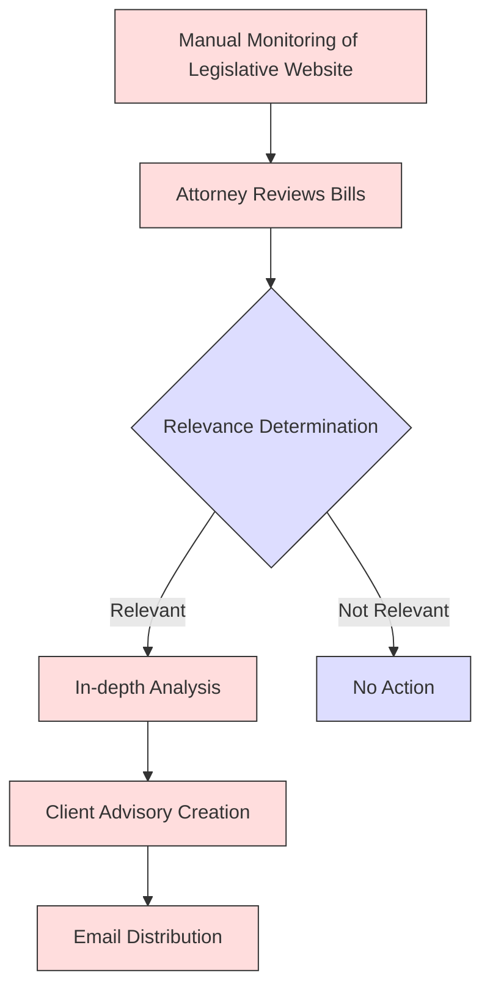
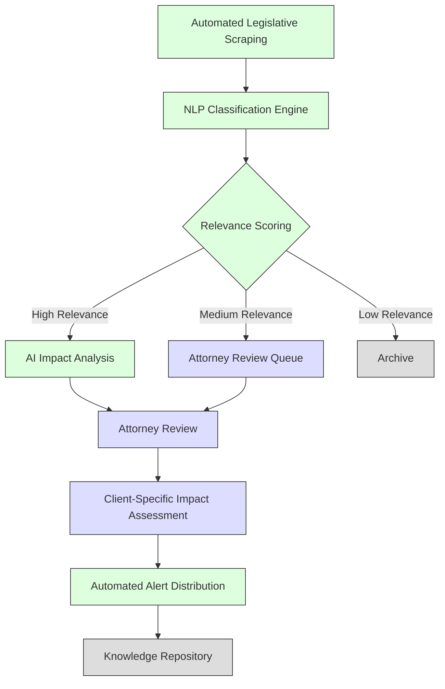
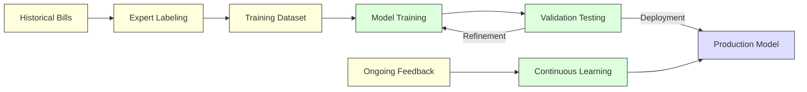
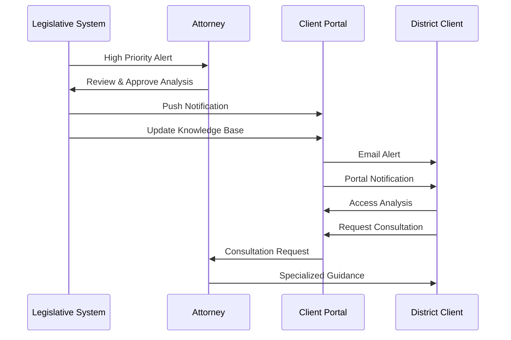
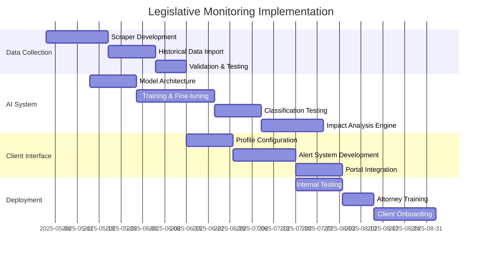

# Legislative Monitoring System for White Bear Ankele

## Strategic Importance

For White Bear Ankele, staying current with Colorado's legislative changes is critical to providing accurate counsel to their special district clients. Changes to laws governing special districts, municipal bonds, public infrastructure, and taxation directly impact their clients' operations and compliance requirements.

## Current Process Analysis

**Key Challenges:**
- Time-intensive manual monitoring
- Risk of overlooking relevant legislation
- Delayed client notifications
- Inconsistent impact analysis
- Difficulty scaling with increasing legislative volume

## AI-Powered Legislative Monitoring System

Our solution implements an advanced AI legislative monitoring system that continuously scans, analyzes, and prioritizes Colorado legislative bills based on relevance to special districts and bond management.

## Core System Components

### 1. Automated Legislative Data Collection

| Data Source | Update Frequency | Data Types |
|-------------|------------------|------------|
| Colorado General Assembly Website | Daily | Bill text, amendments, status |
| Committee Hearings | As published | Transcripts, schedules, testimony |
| Fiscal Impact Statements | As published | Financial analysis, projections |
| Historical Bill Database | One-time + updates | Training data, precedent analysis |

**Technical Implementation:**
- Custom web scrapers with resilient error handling
- Structured data transformation pipeline
- Change detection algorithms
- Database with versioning for bill evolution tracking

### 2. AI Classification & Analysis Engine

| Feature | Function | Technology |
|---------|----------|------------|
| Relevance Classification | Determine bill impact on special districts | Fine-tuned LLM, custom taxonomy |
| Entity Recognition | Identify affected district types | Named entity recognition model |
| Topic Modeling | Categorize by subject matter | Clustering algorithms |
| Impact Prediction | Assess potential client impact | Custom predictive models |

**Model Training Approach:**

### 3. Client Impact Analysis & Notification System

| Component | Description | Value to WBA |
|-----------|-------------|--------------|
| Client Profile Engine | District-specific parameters & concerns | Targeted analysis |
| Impact Matrix Generator | Visual representation of bill effects | Clear client communication |
| Alert Priority System | Urgency-based notification rules | Appropriate response timing |
| Response Templates | Pre-approved advisory frameworks | Consistent communication |

**Client Notification Flow:**

## Implementation Phases

## Technology Requirements

- **Data Processing**: Python, BeautifulSoup, Scrapy
- **Machine Learning**: TensorFlow/PyTorch, fine-tuned LLMs
- **Backend**: Django REST API, containerized microservices
- **Database**: PostgreSQL with document storage
- **Client Interface**: React-based portal integration
- **Security**: End-to-end encryption, role-based access

## Performance Metrics

| Metric | Target | Measurement Method |
|--------|--------|-------------------|
| Bill Classification Accuracy | >95% | Attorney verification |
| Time from Publication to Alert | <24 hours | System timestamps |
| Attorney Time Savings | 70% reduction | Time tracking comparison |
| Client Response Rate | >80% engagement | Portal analytics |
| Impact Prediction Accuracy | >85% correlation | Outcome comparison |

## Competitive Advantage

This system will position White Bear Ankele as the most responsive and proactive special district counsel in Colorado, with several distinct advantages:

1. **First-mover alerts** to clients about relevant legislation
2. **Deeper analysis** through AI-assisted pattern recognition
3. **District-specific impact assessment** rather than generic summaries
4. **Proactive compliance guidance** based on legislative tracking
5. **Historical context integration** from prior related legislation

## Operational Integration

- Weekly attorney review sessions for system refinement
- Integration with document generation system for rapid response
- Alignment with client meeting schedules for timely updates
- Feedback loops for continuous system improvement
