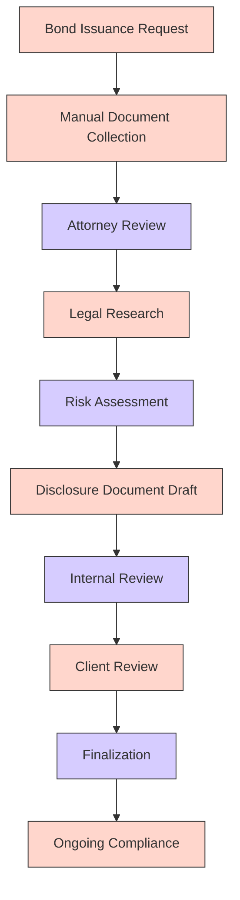
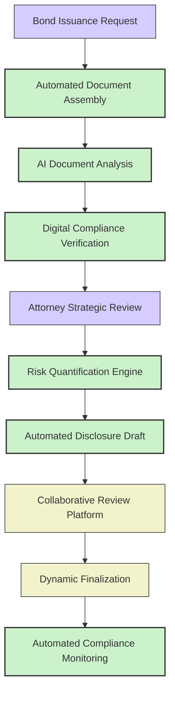
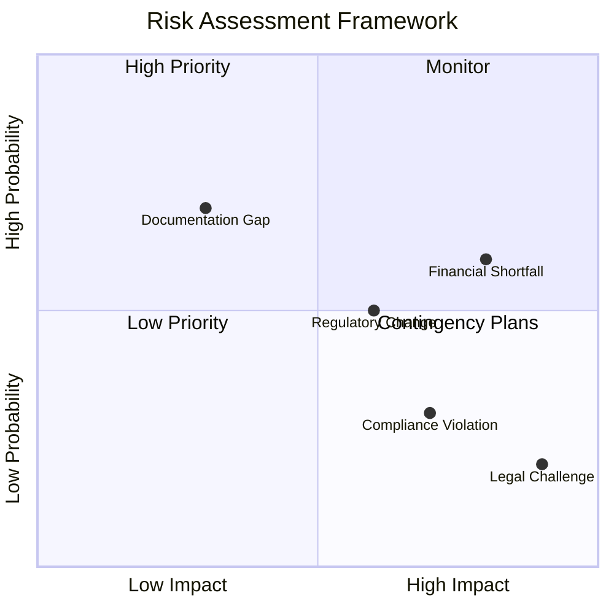
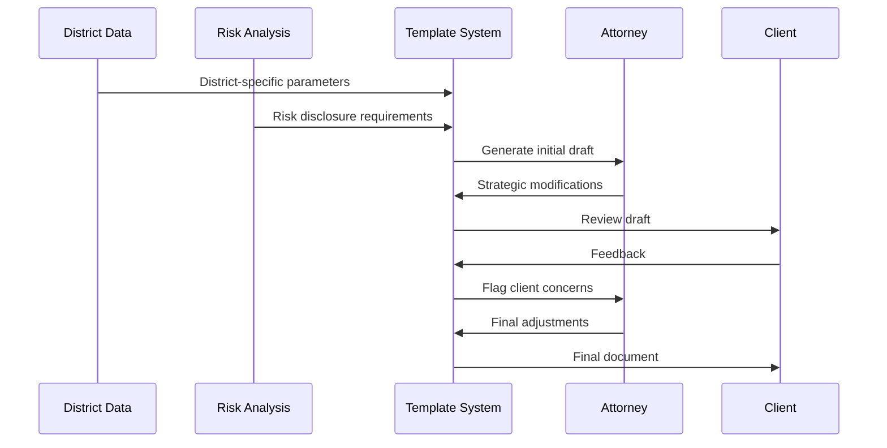
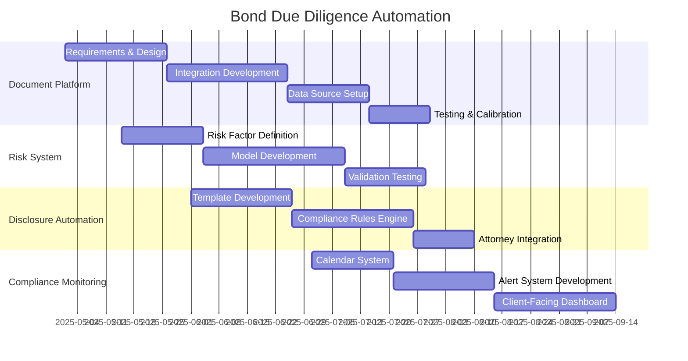

# Bond Due Diligence Automation for White Bear Ankele

## Importance of Bond Due Diligence

For White Bear Ankele, bond due diligence represents a critical service area that directly impacts their special district clients' financing capabilities. Thorough due diligence ensures legal compliance, favorable financing terms, and protection against future challenges.

## Current Due Diligence Process

**Key Inefficiencies:**
- Labor-intensive document gathering
- Inconsistent risk assessment approaches
- Time-consuming legal research
- Potential for human oversight in complex analyses
- Limited scalability during high-demand periods

## AI-Powered Bond Due Diligence System

Our proposed system will transform White Bear Ankele's bond due diligence process through intelligent automation, consistent analysis, and predictive risk assessment.

## System Components

### 1. Document Intelligence Platform

| Feature | Function | Technical Approach |
|---------|----------|-------------------|
| Document Collection | Automated gathering from multiple sources | API integrations, web scraping, OCR |
| Classification Engine | Categorize document types and relevance | NLP-based document classification |
| Content Extraction | Identify key provisions and requirements | Named entity recognition, semantic parsing |
| Comparison Engine | Flag discrepancies between documents | Differential analysis algorithms |

**Document Processing Pipeline:**

```mermaid
flowchart LR
    A[Document Sources] --> B[Collection Engine]
    B --> C[OCR & Text Extraction]
    C --> D[Classification]
    D --> E[Entity Extraction]
    E --> F[Knowledge Graph]
    F --> G[Compliance Database]
    
    classDef input fill:#ffeedd,stroke:#333,stroke-width:1px
    classDef process fill:#ddeeff,stroke:#333,stroke-width:1px
    classDef output fill:#ddffee,stroke:#333,stroke-width:1px
    
    class A input
    class B,C,D,E process
    class F,G output
```

### 2. Risk Quantification System

| Component | Purpose | Methodology |
|-----------|---------|-------------|
| Risk Factor Identification | Detect potential legal and financial risks | Pattern recognition, precedent analysis |
| Impact Assessment | Quantify financial implications of risks | Statistical modeling, scenario analysis |
| Mitigation Recommendation | Suggest approaches to address risks | Rule-based expert system |
| Risk Visualization | Present clear risk matrices to clients | Interactive data visualization |

**Risk Assessment Matrix:**

### 3. Disclosure Document Automation

| Feature | Capability | Value Proposition |
|---------|------------|-------------------|
| Template Engine | Dynamic document assembly | Consistency, time savings |
| Compliance Checker | Verify required disclosures | Regulatory compliance |
| Language Optimization | Clear, precise legal language | Reduced legal risk |
| Cross-referencing | Ensure internal consistency | Document integrity |

**Document Generation Flow:**

### 4. Ongoing Compliance Monitoring

| Component | Function | Implementation |
|-----------|----------|----------------|
| Calendar System | Track reporting deadlines | Automated scheduling |
| Regulatory Updates | Monitor relevant rule changes | Legislative integration |
| Compliance Scoring | Rate ongoing district compliance | Custom scoring algorithms |
| Alert System | Notify attorneys of upcoming needs | Multi-channel notifications |

## Implementation Plan

## Expected Benefits

1. **Efficiency Improvements**
   - 65% reduction in document gathering time
   - 50% decrease in initial review time
   - 75% faster risk assessment process

2. **Quality Enhancements**
   - 90% consistency in risk identification
   - 95% accuracy in disclosure requirements
   - 80% reduction in disclosure omissions

3. **Strategic Advantages**
   - Ability to handle higher volume during peak periods
   - Standardized approach across attorney teams
   - Better client communication through visualization
   - More competitive pricing through efficiency

## Integration Points

- Connection to Legislative Monitoring System for regulatory updates
- Linkage with Client Portal for collaborative review
- Integration with Document Generation System
- Data exchange with district information database

## Client-Specific Customization

The system will maintain White Bear Ankele's high-touch approach while adding automation by:

1. Maintaining attorney oversight at strategic decision points
2. Preserving client-specific knowledge and relationships
3. Customizing risk assessments to district characteristics
4. Adapting disclosure language to specific bond types

## Training & Adoption Plan

- Phased rollout beginning with document collection
- Side-by-side comparison to demonstrate accuracy
- Attorney workshops for system utilization
- Client education on enhanced capabilities
- Continuous feedback loops for system refinement
