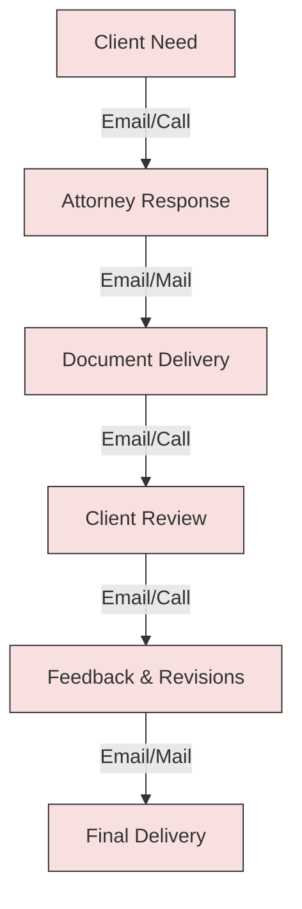
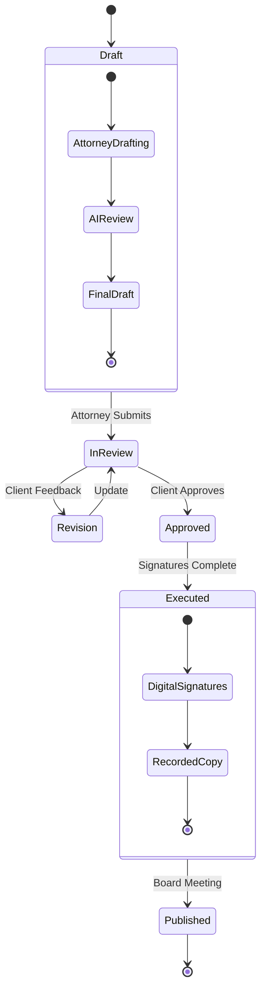
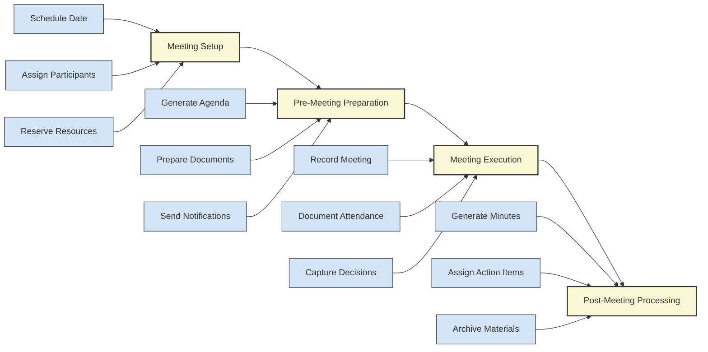
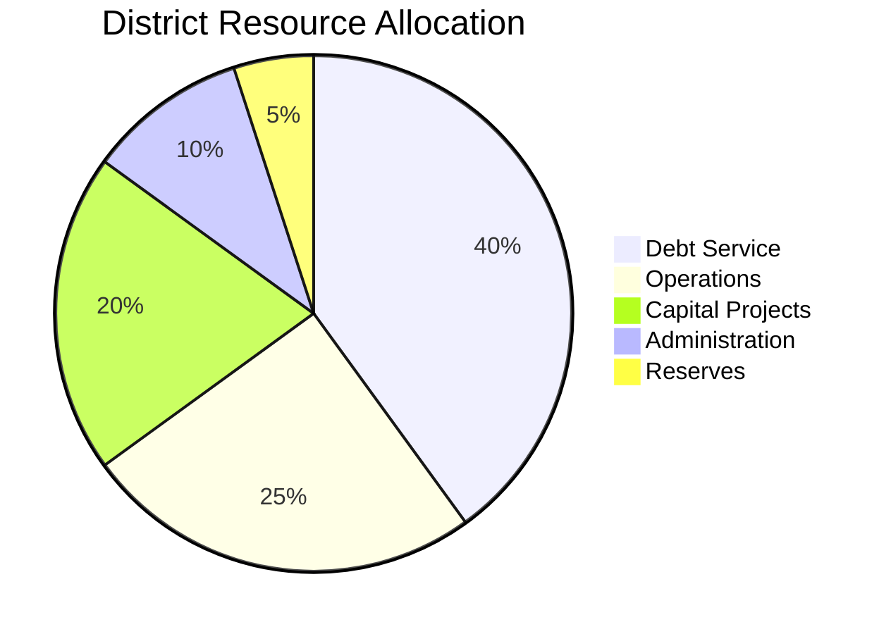
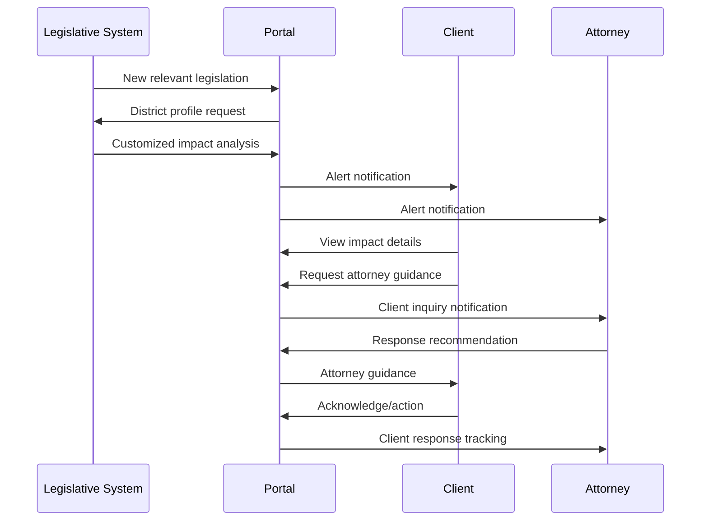
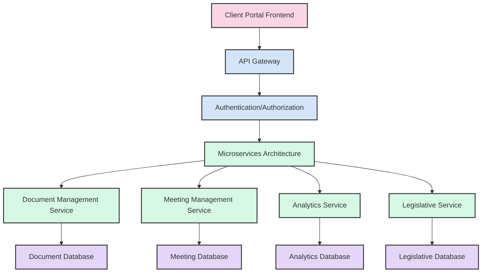
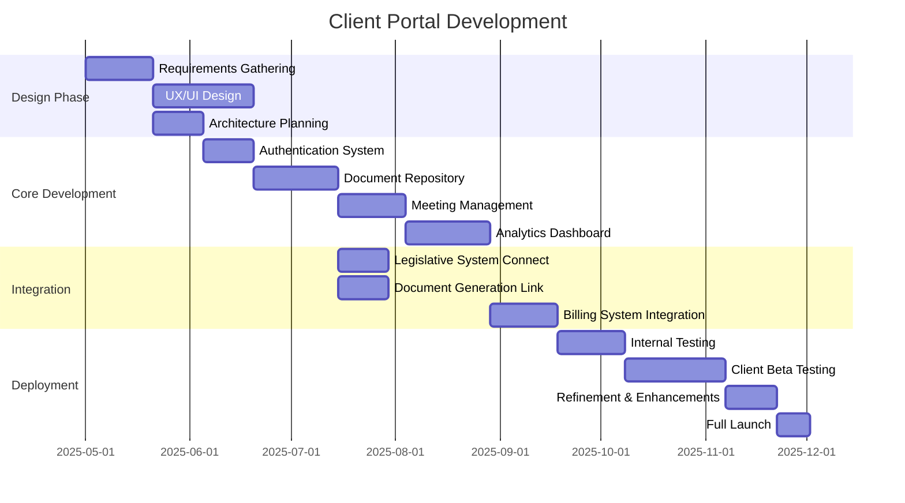

# Client Portal Development for White Bear Ankele

## Current Client Communication State

White Bear Ankele's current client communication model relies primarily on traditional methods like email, phone calls, and in-person meetings. While effective, this approach has limitations in terms of efficiency, transparency, and collaboration, particularly when managing hundreds of special districts.

## Client Portal Vision

Our proposed secure client portal will transform how White Bear Ankele collaborates with special district clients, offering a centralized platform for document management, meeting coordination, and real-time updates on legislative impacts.

```mermaid
flowchart TD
    A[Client Dashboard] --> B[Document Repository]
    A --> C[Meeting Center]
    A --> D[District Analytics]
    A --> E[Legislative Impact]
    
    B --> B1[Secure Document Storage]
    B --> B2[Collaborative Editing]
    B --> B3[Version Control]
    B --> B4[E-Signature Integration]
    
    C --> C1[Meeting Scheduling]
    C --> C2[Agenda Management]
    C --> C3[Minutes & Recording]
    C --> C4[Action Item Tracking]
    
    D --> D1[Financial Metrics]
    D --> D2[Compliance Status]
    D --> D3[Project Timelines]
    D --> D4[Budget Visualization]
    
    E --> E1[Bill Tracking]
    E --> E2[Impact Assessment]
    E --> E3[Compliance Updates]
    E --> E4[Required Actions]
    
    classDef main fill:#e0f9e0,stroke:#333,stroke-width:2px
    classDef sub fill:#f0f0f0,stroke:#333,stroke-width:1px
    
    class A,B,C,D,E main
    class B1,B2,B3,B4,C1,C2,C3,C4,D1,D2,D3,D4,E1,E2,E3,E4 sub
```

## Portal Components & Features

### 1. Secure Document Management System

| Feature | Description | Client Benefit |
|---------|-------------|----------------|
| **Centralized Repository** | Organized storage of all district documents | Easy access to historical records |
| **Permission Controls** | Role-based access for board members and staff | Appropriate information security |
| **Version Tracking** | Complete document history with change tracking | Transparency in document evolution |
| **Template Library** | Access to standard district document templates | Consistency in documentation |
| **AI-Powered Search** | Natural language search across all documents | Rapid information retrieval |

**Document Lifecycle Management:**

### 2. District Meeting Management

| Feature | Function | Value Proposition |
|---------|----------|-------------------|
| **Meeting Scheduler** | Coordinate board meetings with automatic notifications | Improved attendance, fewer scheduling conflicts |
| **Agenda Builder** | Collaborative agenda creation with required items | Compliance with open meeting laws |
| **Documentation Distributor** | Pre-meeting materials distribution with tracking | Better prepared board members |
| **Minutes Generator** | AI-assisted minutes creation from recordings | Time savings, consistent documentation |
| **Action Item Tracker** | Follow-up assignment and deadline monitoring | Greater accountability |

**Meeting Workflow:**

### 3. District Analytics Dashboard

| Component | Metrics | Application |
|-----------|---------|-------------|
| **Financial Health** | Bond ratings, debt service, assessment collection | Financial planning |
| **Compliance Status** | Filing deadlines, certification status, audit prep | Risk management |
| **Project Tracking** | Capital projects, timelines, budget vs. actual | Resource allocation |
| **Board Governance** | Meeting attendance, resolution tracking, policy updates | Governance improvement |

**Dashboard Visualization:**

### 4. Legislative Impact Center

| Feature | Function | Implementation |
|---------|----------|----------------|
| **Bill Tracking** | Monitor relevant legislation | Integration with legislative monitoring system |
| **Impact Analysis** | District-specific legislative effects | AI-powered custom analysis |
| **Compliance Calendar** | Upcoming requirements and deadlines | Automated scheduling and alerts |
| **Action Recommendations** | Suggested responses to legislative changes | Expert system with attorney oversight |

**Legislative Alert Flow:**

## User Experience Design

The portal will be designed with different user personas in mind:

1. **District Board Members**
   - Simple, intuitive interface
   - High-level district status view
   - Document review and approval tools
   - Meeting participation support

2. **District Managers**
   - Comprehensive district management tools
   - Detailed compliance tracking
   - Project and resource management
   - Communication coordination

3. **WBA Attorneys**
   - Client activity monitoring
   - Integrated document creation
   - Proactive alert notifications
   - Client engagement metrics

## Technical Implementation

## Technology Stack

- **Frontend**: React, Material UI, D3.js for visualizations
- **Backend**: Node.js microservices, Python for AI components
- **Database**: PostgreSQL, MongoDB for document storage
- **Security**: OAuth 2.0, end-to-end encryption, role-based access control
- **Compliance**: SOC 2, HIPAA standards for data protection
- **Integration**: REST APIs, GraphQL for complex data queries

## Implementation Timeline

## Security & Compliance Measures

- Multi-factor authentication for all users
- Data encryption at rest and in transit
- Detailed audit logging of all system activities
- Regular security penetration testing
- Compliance with attorney-client privilege standards
- Disaster recovery and business continuity planning

## Success Metrics

| Metric | Target | Measurement Method |
|--------|--------|-------------------|
| Client Adoption Rate | >80% of districts | User registration statistics |
| Document Search Time | 75% reduction | Time tracking comparison |
| Meeting Preparation Efficiency | 60% time savings | Staff time allocation tracking |
| Client Satisfaction | NPS >70 | Quarterly satisfaction surveys |
| Attorney Time Optimization | 35% more client focus | Time tracking analysis |

## Change Management & Training

- Phased rollout starting with most tech-savvy clients
- Video tutorial library for self-guided learning
- Live training sessions for board members and staff
- Quick reference guides for common tasks
- Dedicated support during initial adoption period
- Monthly feature webinars highlighting new capabilities
