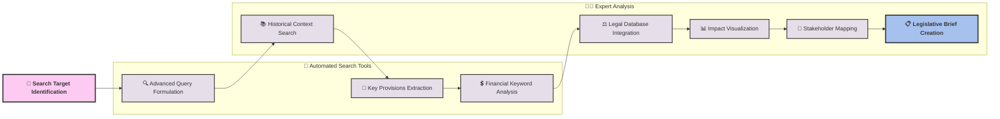
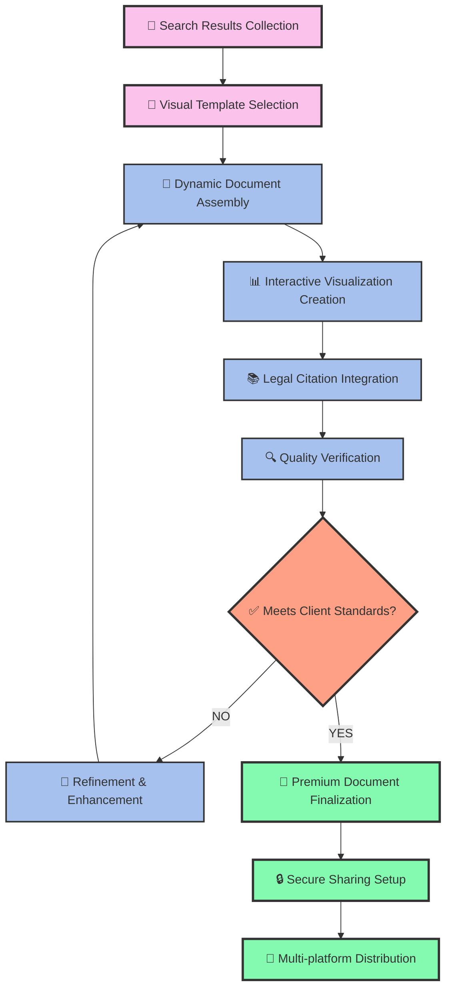
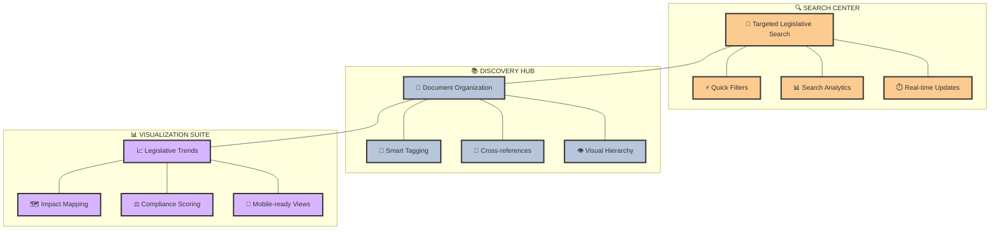

# 🔍 Advanced Legislative Web Search & Discovery Workflow

This document illustrates the sophisticated workflow for conducting investment bond due diligence using Colorado Legal Investors' web search capabilities.

## 🌟 Executive Discovery Process

```mermaid
flowchart TD
    A["🚀 INITIATE SEARCH"] --> B["🌐 Web Research Phase"]
    B --> C["📋 Initial Filtering"]
    C --> D{"💹 Investment Impact Analysis"}
    D --> E["⚖️ Legal Precedent Search"]
    E --> F["🔐 Compliance Verification"]
    F --> G["📑 Discovery Documentation"]
    G --> H["👥 Stakeholder Review"]
    H --> I{"🔄 Refinement Needed?"}
    I -->|"YES"| J["✏️ Search Refinement"]
    J --> B
    I -->|"NO"| K["✅ Finalize Discovery Report"]
    K --> L["🗃️ Knowledge Repository"]
    L --> M["🏁 COMPLETE"]
    
    classDef start fill:#ff9a8b,stroke:#333,stroke-width:3px,color:white,font-weight:bold
    classDef process fill:#fad0c4,stroke:#333,stroke-width:2px
    classDef decision fill:#ffd1ff,stroke:#333,stroke-width:2px
    classDef document fill:#c2e9fb,stroke:#333,stroke-width:2px
    classDef end fill:#a1c4fd,stroke:#333,stroke-width:3px,color:white,font-weight:bold
    
    class A start
    class B,C,E,F,J process
    class D,I decision
    class G,K document
    class L,M end
```

## 🔎 Advanced Web Search Strategy



## 📊 Discovery Documentation Process



## 🌈 Interactive Research Dashboard


