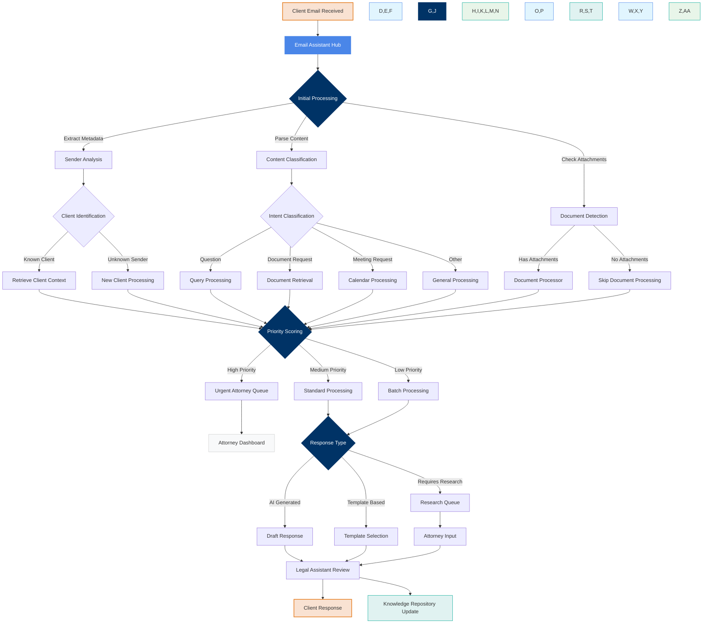
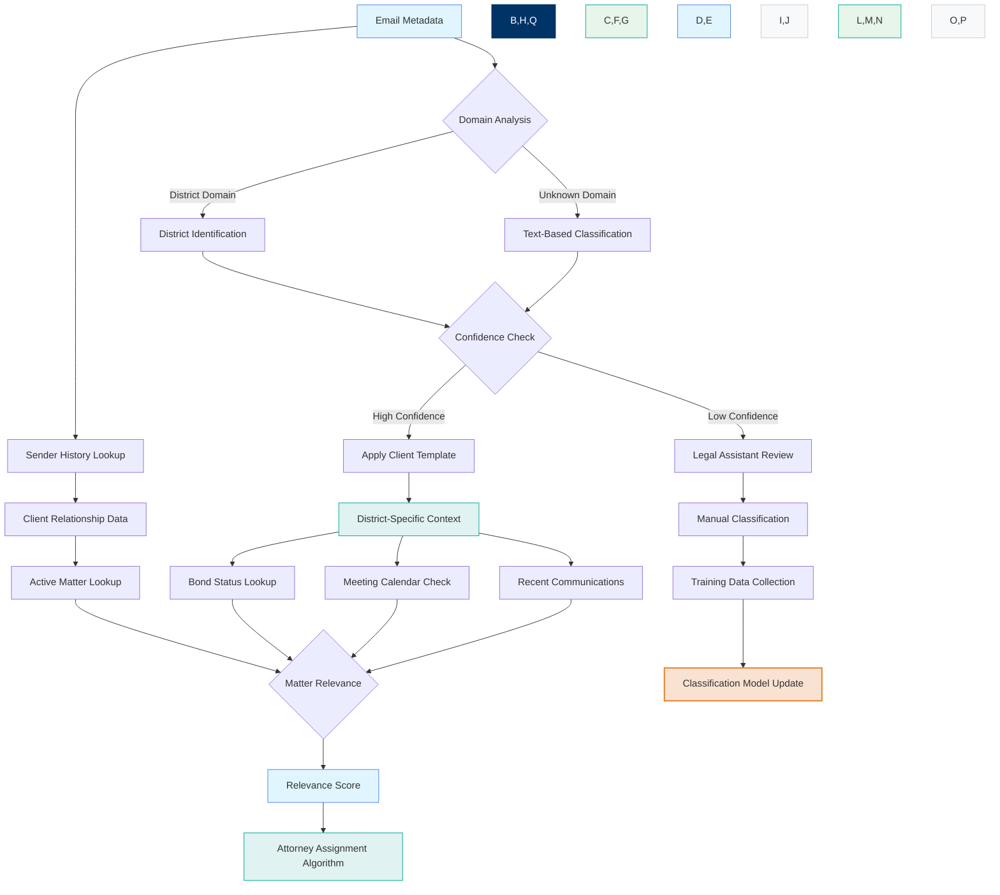
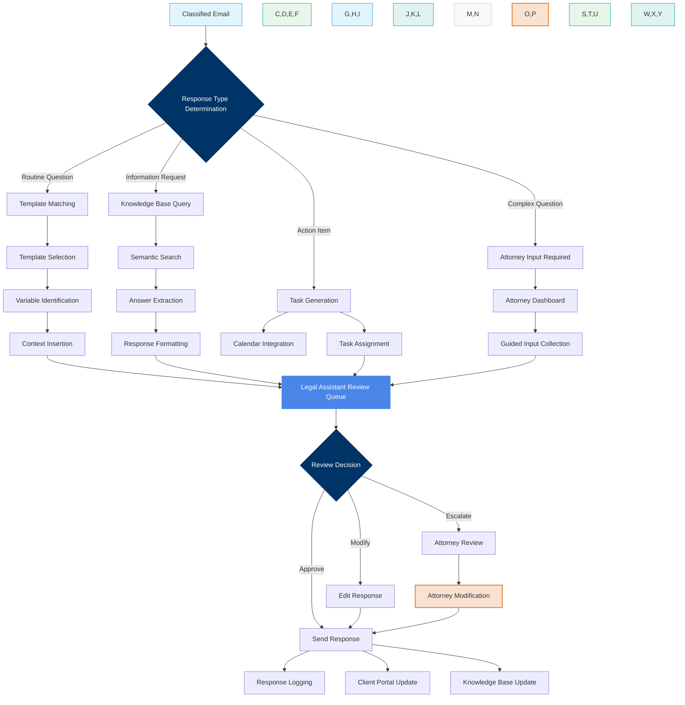
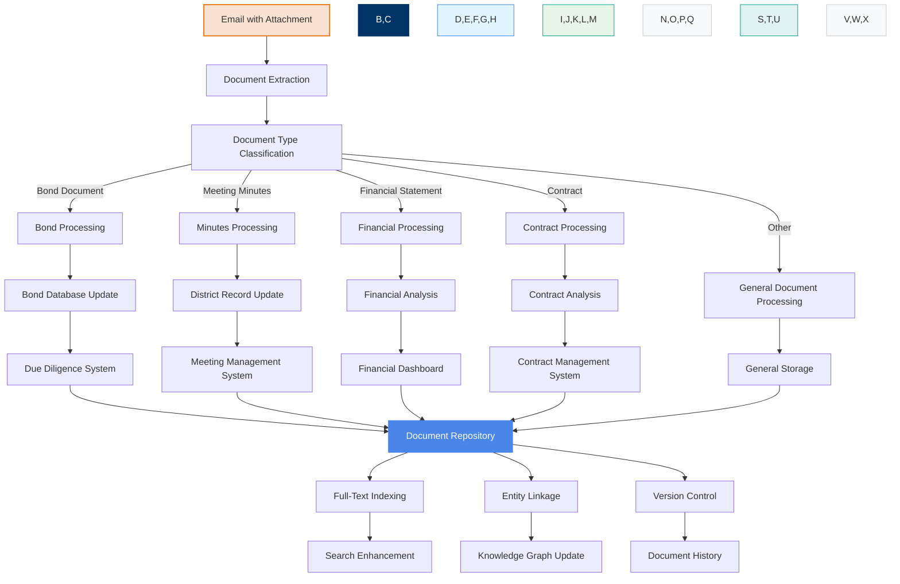

  
  <h1>Email Assistant Hub: Process Workflows</h1>
  
<em>Detailed process flows for the primary entry point to White Bear Ankele's AI ecosystem</em>

  <h3 style="margin-top: 0; color: white; margin-bottom: 20px;">💡 Process Optimization Focus</h3>
  
These process maps illustrate how the Email Assistant Hub transforms White Bear Ankele's communication workflows, enhancing legal assistant capabilities while ensuring attorneys maintain oversight of critical client interactions.

## Contents

- [Email Processing Workflow](#email-processing-workflow)
- [Client Classification Process](#client-classification-process)
- [Response Generation Flow](#response-generation-flow)
- [Document Handling Process](#document-handling-process)
- [Integration Touchpoints](#integration-touchpoints)
- [Legal Assistant Dashboard](#legal-assistant-dashboard)

## Email Processing Workflow

The core workflow that handles incoming client emails, from receipt to resolution.

  <h4 style="margin-top: 0; color: #003366;">Key Process Improvements</h4>
  <ul style="margin-bottom: 0;">
    <li><strong>Automated Triage</strong> - Initial classification happens within seconds of email receipt</li>
    <li><strong>Contextual Processing</strong> - Client history and matter context influences handling</li>
    <li><strong>Legal Assistant Empowerment</strong> - Assistants review AI-generated responses rather than drafting from scratch</li>
    <li><strong>Knowledge Capture</strong> - Every interaction enriches the firm's knowledge repository</li>
  </ul>

## Client Classification Process

How the system identifies and categorizes client communications for appropriate handling.

## Response Generation Flow

The process for creating appropriate, context-aware responses to client emails.

## Document Handling Process

How email attachments are processed, classified, and integrated with the firm's knowledge systems.

## Integration Touchpoints

How the Email Assistant Hub connects with other systems in the White Bear Ankele AI ecosystem.

```mermaid
flowchart TD
    A[Email Assistant Hub] -->|Bond Documents| B[Bond Due Diligence System]
    A -->|Legislative Queries| C[Legislative Monitoring System]
    A -->|Meeting Requests| D[Calendar Management]
    A -->|Document Requests| E[Document Repository]
    A -->|Status Updates| F[Client Portal]
    
    B -->|Compliance Alerts| A
    C -->|Legislative Updates| A
    D -->|Meeting Confirmations| A
    E -->|Document Status| A
    F -->|Client Messages| A
    
    A -->|Client Communication| G[Attorney Dashboard]
    G -->|Response Guidance| A
    
    A -->|Task Generation| H[Legal Assistant Dashboard]
    H -->|Task Completion| A
    
    A -->|Knowledge Updates| I[Knowledge Repository]
    I -->|Context Enrichment| A
    
    style A fill:#4a86e8,color:#ffffff,stroke:#4a86e8,stroke-width:2px
    style B,C,D,E,F fill:#003366,color:#ffffff,stroke:#003366,stroke-width:2px
    style G fill:#f9e2d2,stroke:#e67e22,stroke-width:2px
    style H fill:#e0f2f1,stroke:#00a896,stroke-width:1px
    style I fill:#e8f5e9,stroke:#00a896,stroke-width:1px
```

## Legal Assistant Dashboard

The primary interface for legal assistants to manage email communications and leverage AI capabilities.

  

  

    <h4 style="margin-top: 0; color: #003366;">Email Queue Management</h4>
    <ul style="margin-bottom: 0; padding-left: 20px;">
      <li>AI-prioritized email queue</li>
      <li>Color-coded urgency indicators</li>
      <li>District and matter grouping</li>
      <li>One-click response approval</li>
    </ul>
  

  
  

    <h4 style="margin-top: 0; color: #003366;">Response Management</h4>
    <ul style="margin-bottom: 0; padding-left: 20px;">
      <li>AI-generated response previews</li>
      <li>Template management interface</li>
      <li>Edit suggestions based on context</li>
      <li>Approval routing controls</li>
    </ul>
  

  
  

    <h4 style="margin-top: 0; color: #003366;">Document Processing</h4>
    <ul style="margin-bottom: 0; padding-left: 20px;">
      <li>Attachment classification display</li>
      <li>Document routing controls</li>
      <li>Version comparison view</li>
      <li>Storage location selection</li>
    </ul>
  

  
  

    <h4 style="margin-top: 0; color: #003366;">Analytics & Insights</h4>
    <ul style="margin-bottom: 0; padding-left: 20px;">
      <li>Response time metrics</li>
      <li>Volume patterns by district</li>
      <li>Common client questions</li>
      <li>AI assistance effectiveness</li>
    </ul>
  

### Dashboard Capabilities

The Legal Assistant Dashboard is specifically designed to empower legal assistants with AI capabilities while maintaining appropriate human oversight:

1. **Smart Queue Management**
   - AI-prioritized email list based on urgency, client importance, and content
   - Batch processing capabilities for similar emails
   - Follow-up tracking and automated reminders

2. **Enhanced Response Tools**
   - One-click approval for AI-generated responses
   - Easy editing interface with context-aware suggestions
   - Template management with variable customization
   - Response history and effectiveness tracking

3. **Document Handling**
   - Automated attachment classification with override capabilities
   - Direct integration with document management system
   - Version tracking and comparison visualization
   - Metadata enrichment tools

4. **Client Intelligence**
   - District-specific communication history
   - Sentiment analysis and relationship indicators
   - Key dates and deadline tracking
   - Communication preference management

  <h3 style="color: white; margin-top: 0;">Ready to Transform Email Management?</h3>
  
The Email Assistant Hub represents the ideal entry point for White Bear Ankele's AI transformation, delivering immediate ROI while establishing the foundation for comprehensive practice optimization.

  
GET STARTED WITH IMPLEMENTATION

  
Created by SquizAI | Process Map Version 1.0 | Updated April 2025

