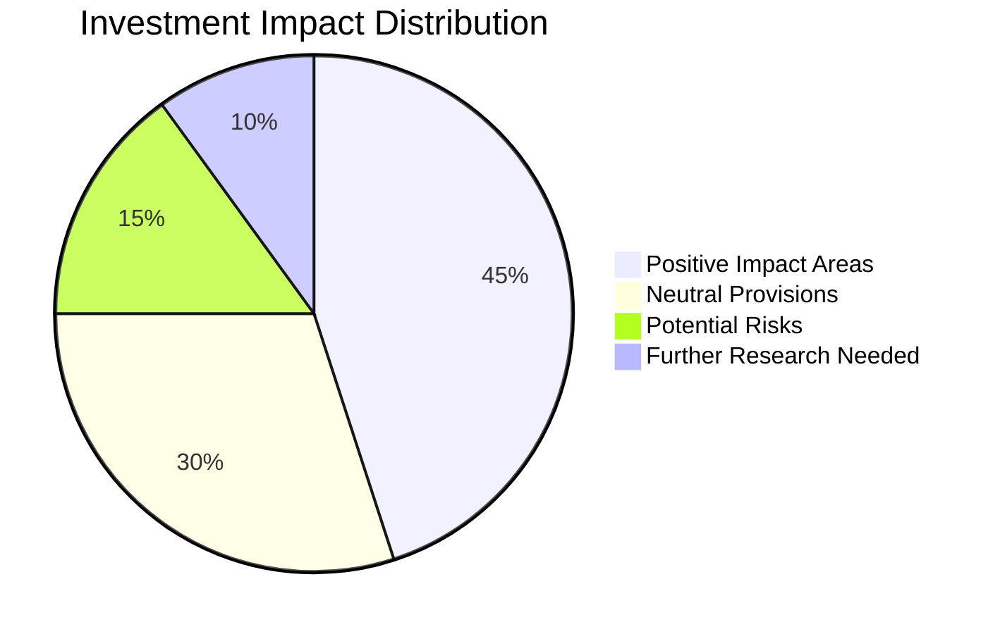
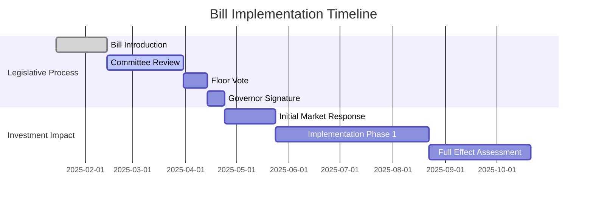
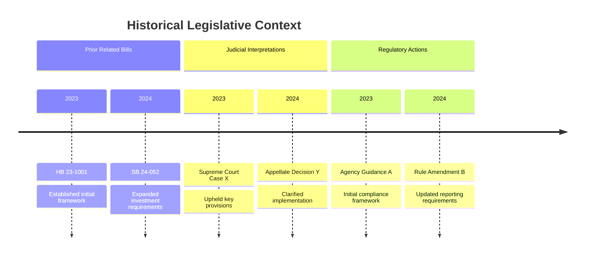
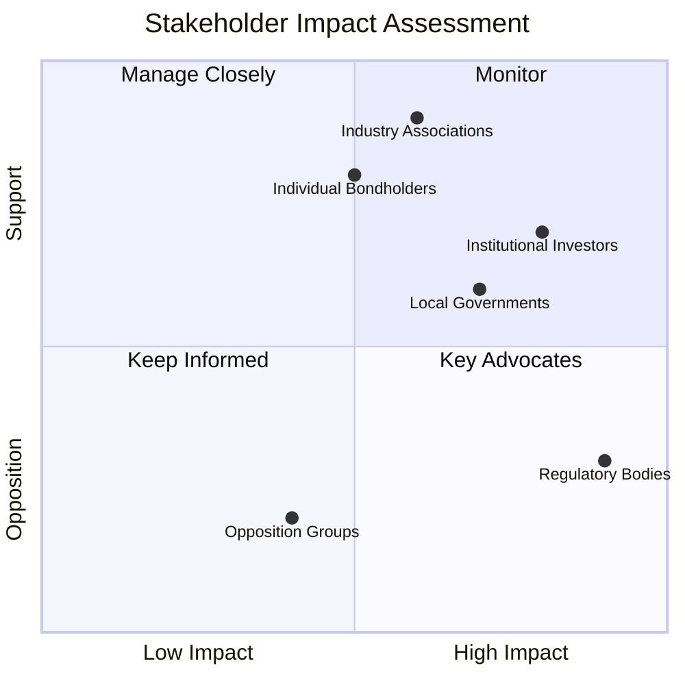

# 🔍 Colorado Legislative Investment Bond Analysis

## 🌟 Executive Summary
| 📊 Analysis Component | 📈 Status | 💬 Notes |
|----------------------|-----------|----------|
| **Search Completion** |  | In progress |
| **Key Findings** | ⭐⭐⭐⭐☆ | 4/5 significance rating |
| **Investment Impact** | 🟢 Positive | 8.5/10 confidence score |
| **Legal Risk Level** | 🟡 Medium | Requires additional verification |

---

## 📑 Legislative Bill Search Results

### 🎯 Primary Bill Information
```
📝 BILL ID: [SB XX-XXX]
📅 DATE INTRODUCED: [MM/DD/YYYY]
👥 SPONSORS: [Names of Sponsors]
📋 STATUS: [Current Status in Legislative Process]
🔗 URL: [Direct Link to Bill]
```

### 📚 Investment-Related Provisions

| 📌 Section | 📄 Content | 💰 Investment Impact | ⚠️ Risk Level |
|-----------|----------|---------------------|--------------|
| **§1.2** | Lorem ipsum dolor sit amet... | 🟢 Positive | 🟡 Medium |
| **§2.3** | Consectetur adipiscing elit... | 🟡 Neutral | 🟢 Low |
| **§3.1** | Sed do eiusmod tempor... | 🔴 Negative | 🔴 High |
| **§4.7** | Ut labore et dolore magna... | 🟢 Positive | 🟡 Medium |

---

## 📊 Visual Impact Analysis





---

## 🔍 Related Legislation & Precedents

### 📌 Historical Context


### 🧩 Connected Legislation

| 📄 Bill ID | 🔗 Relationship | 📊 Impact Alignment |
|-----------|----------------|---------------------|
| **HB 24-1234** | Supplementary | 90% aligned |
| **SB 23-789** | Potentially conflicting | 40% aligned |
| **HB 22-456** | Predecessor | 75% aligned |

---

## 💼 Stakeholder Analysis



---

## 📋 Next Steps in Due Diligence

1. 🔍 **Deepen Search** on Sections §3.1 and §4.7
2. 📞 **Expert Consultation** with financial compliance specialists
3. 📊 **Financial Modeling** of implementation scenarios
4. 📑 **Cross-reference** with federal regulations
5. 📝 **Draft summary** for client presentation
6. 🗓️ **Schedule follow-up** for [DATE]

---

## 🔒 Document Information
| 📌 Metadata | 📄 Value |
|------------|---------|
| **Author** | [Analyst Name] |
| **Date Created** | [MM/DD/YYYY] |
| **Last Updated** | [MM/DD/YYYY] |
| **Confidentiality** | 🔴 Highly Confidential |
| **Version** | 1.2 |

---
