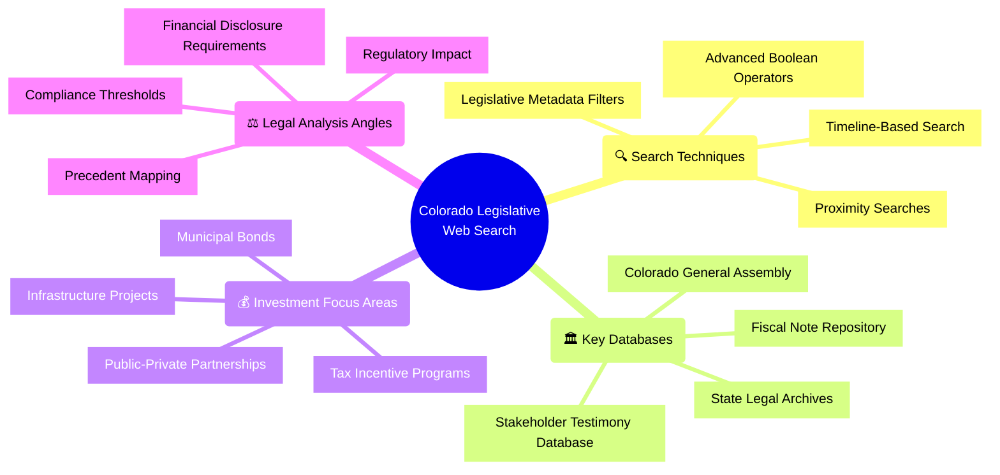
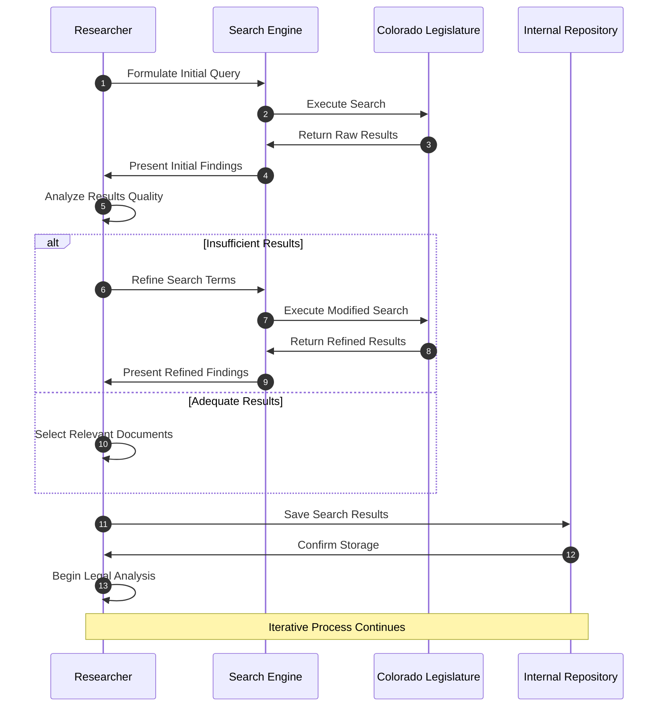
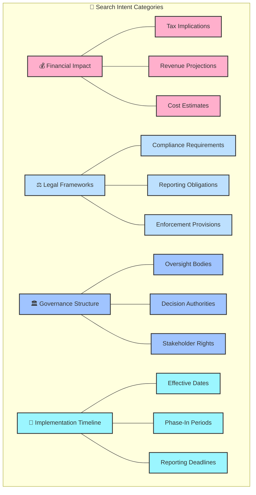
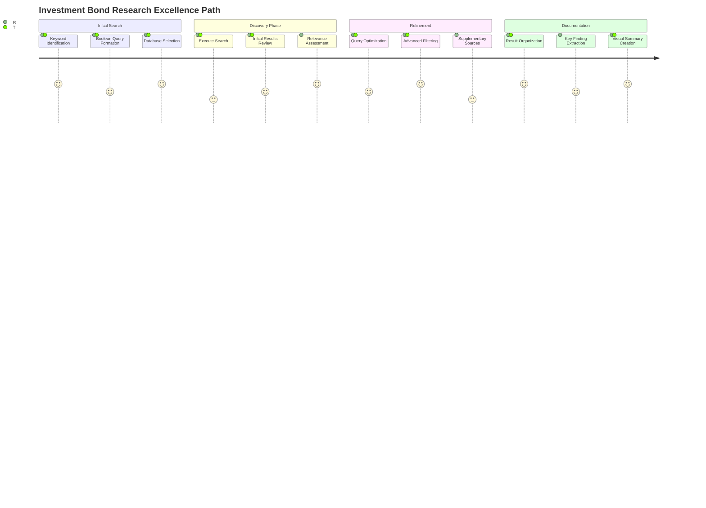
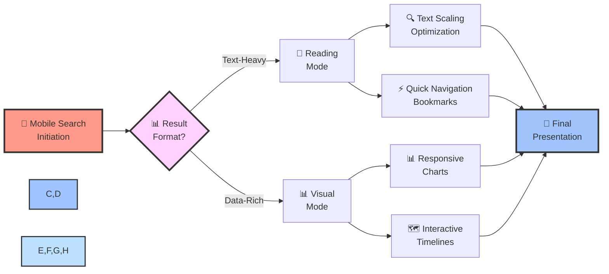
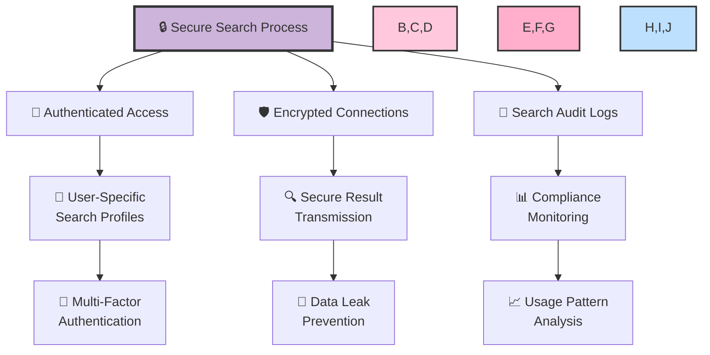

# 🚀 Advanced Legislative Web Search Strategy

## 🎯 Strategic Search Framework



## 🧠 Smart Query Construction

| 🔎 Search Technique | 🔧 Syntax Example | 🎯 Use Case | 💫 Impact Level |
|-----------------|----------------|----------|--------------|
| **Boolean AND** | `investment AND bond AND municipal` | Narrow results to specific context | 🌟🌟🌟🌟 |
| **Phrase Search** | `"debt service requirements"` | Find exact terminologies | 🌟🌟🌟🌟🌟 |
| **Exclusion** | `bond -corporate -federal` | Remove irrelevant contexts | 🌟🌟🌟 |
| **Wildcard** | `invest*` | Capture variations (investment, investing) | 🌟🌟 |
| **Field Search** | `sponsor:"Smith"` | Target specific bill metadata | 🌟🌟🌟🌟 |
| **Date Range** | `introduced:[2023-01-01 TO 2025-04-08]` | Chronological filtering | 🌟🌟🌟 |

## 📊 Search Performance Dashboard

```mermaid
xychart-beta
    title "Search Query Performance Analysis"
    x-axis "Query Precision Level" [1, 2, 3, 4, 5, 6, 7, 8, 9, 10]
    y-axis "Relevant Results (%)" [0, 10, 20, 30, 40, 50, 60, 70, 80, 90, 100]
    bar [10, 22, 35, 48, 60, 71, 84, 92, 96, 98]
    line [12, 25, 39, 51, 66, 79, 88, 95, 97, 99]
```

## 🔄 Web Search Workflow



## 🌈 Visual Search Matrix



## 🚀 Search Excellence Framework



## 📱 Mobile Search Optimization



## 🔐 Security & Confidentiality



## 📋 Search Template

```
🔍 TARGET SEARCH: [Primary Legislative Topic]

📚 KEY TERMS:
- [Primary Term 1]
- [Primary Term 2]
- [Primary Term 3]

🧮 BOOLEAN QUERY:
([Term1] OR [Synonym1a] OR [Synonym1b]) AND ([Term2] OR [Synonym2]) AND [Term3] NOT [ExcludeTerm]

📅 DATE RANGE: [Start Date] to [End Date]

🏛️ SOURCES:
- [Source 1] - Priority: [High/Medium/Low]
- [Source 2] - Priority: [High/Medium/Low]
- [Source 3] - Priority: [High/Medium/Low]

⭐ RELEVANCE INDICATORS:
- Presence of phrases: "[Key Phrase 1]", "[Key Phrase 2]"
- Sections on: [Topic A], [Topic B]
- Referenced standards: [Standard X], [Standard Y]

📊 DOCUMENT TYPES:
- [Bill Text] - Importance: ⭐⭐⭐⭐⭐
- [Fiscal Notes] - Importance: ⭐⭐⭐⭐
- [Committee Reports] - Importance: ⭐⭐⭐
- [Testimony Transcripts] - Importance: ⭐⭐

🏆 SUCCESS CRITERIA:
- [X] Find at least [Number] relevant bills
- [X] Identify key investment provisions
- [X] Locate financial impact analyses
- [X] Document legal precedents
```
